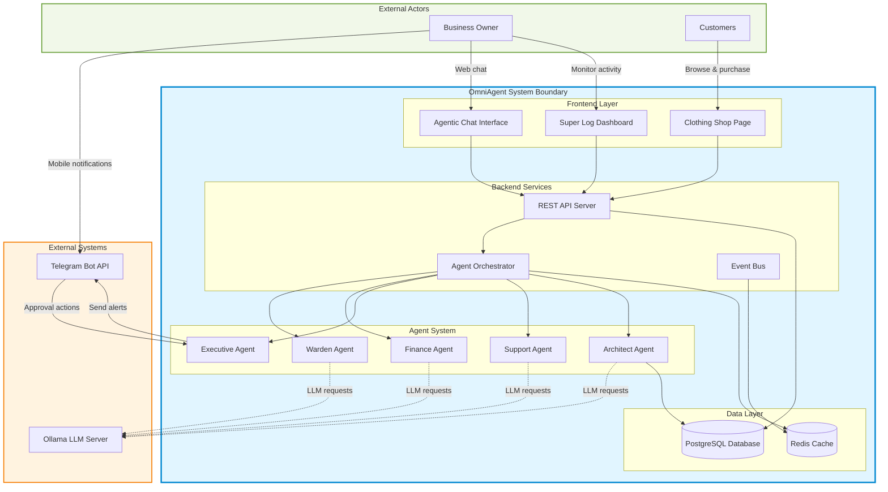
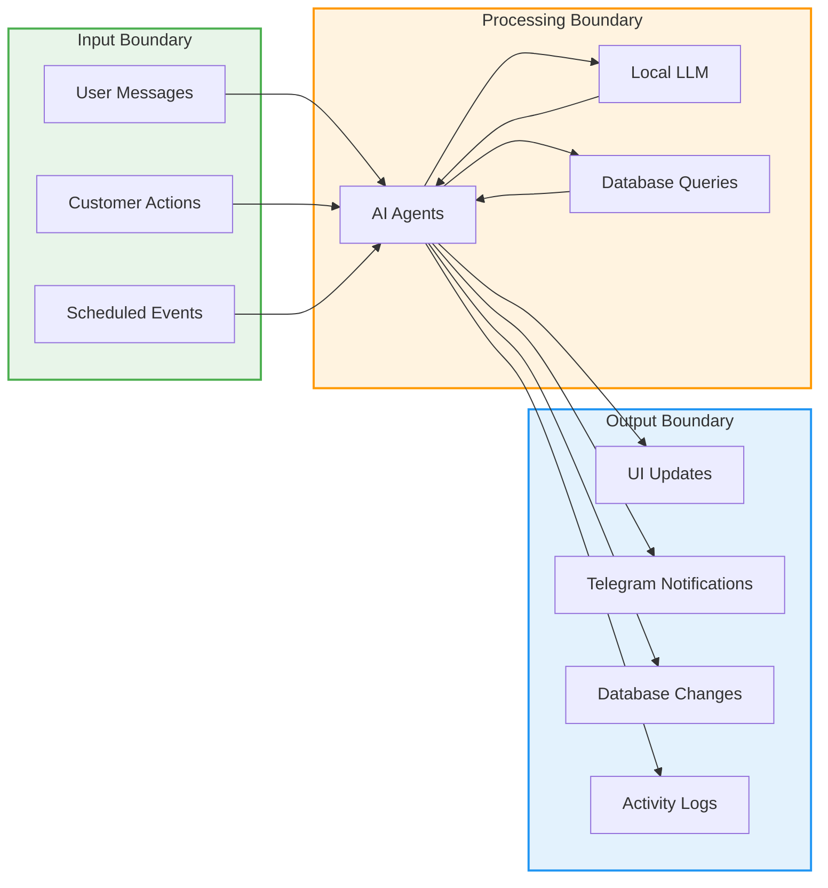
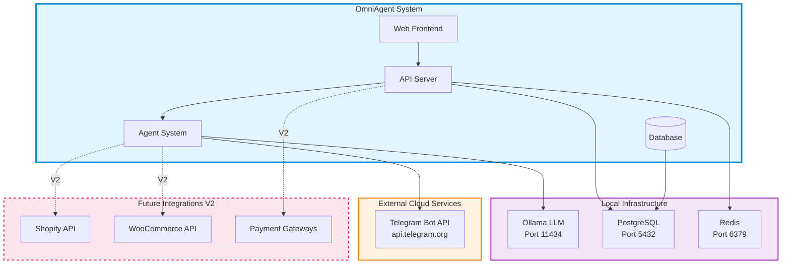

# System Overview & Context

**Document Version:** 1.0  
**Last Updated:** February 12, 2026  
**Project:** OmniAgent Clothing Store

---

## Executive Summary

OmniAgent is a multi-agent orchestration system designed to transform how solo entrepreneurs and small business owners manage their clothing e-commerce operations. By leveraging local AI agents powered by Ollama, the system proactively monitors business operations, identifies issues, and presents actionable solutions—all through a single chat interface and mobile notifications.

Unlike traditional business intelligence dashboards that require constant monitoring, OmniAgent **hunts for problems** and brings solutions directly to the business owner, enabling them to manage complex operations in the "cracks" of their day.

---

## Business Context & Problem Statement

### The Challenge: Decision Fatigue & Time Poverty

Solo entrepreneurs and small business owners face a critical challenge: they must simultaneously act as CEO, Support Staff, Accountant, and Operations Manager. This results in:

- **Decision Fatigue**: Constantly switching between strategic thinking and operational tasks
- **Time Poverty**: Insufficient hours to properly analyze data and make informed decisions
- **Reactive Management**: Discovering problems after they've already impacted the business
- **Information Overload**: Too much data, not enough actionable insights

**Reference:** See [`solving-painpoints.md`](./solving-painpoints.md) for detailed problem analysis.

### The Solution: AI-Powered Force Multiplier

OmniAgent acts as a virtual staff that:

1. **Monitors Continuously**: 24/7 surveillance of inventory, sales, customer behavior
2. **Analyzes Proactively**: Identifies trends, anomalies, and opportunities before they become critical
3. **Recommends Intelligently**: Provides context-aware suggestions backed by financial analysis
4. **Executes Efficiently**: Implements approved decisions automatically via Human-in-the-Loop (HITL) workflow

---

## System Vision & Goals

### Vision Statement

To empower solo entrepreneurs with enterprise-grade business intelligence and automation, enabling them to compete with larger organizations while maintaining work-life balance.

### Primary Goals

1. **Reduce Decision Time**: From hours of spreadsheet analysis to minutes of reviewing agent recommendations
2. **Prevent Stockouts**: Proactive inventory monitoring with automated restock proposals
3. **Maximize Revenue**: Identify trending products and capitalize on demand spikes
4. **Automate Support**: Draft customer responses based on real order and inventory data
5. **Maintain Privacy**: All sensitive business data stays local using Ollama (no external AI APIs)

### Success Metrics

| Metric | Target | Measurement |
|--------|--------|-------------|
| Time spent on data analysis | -75% | Owner logs review time vs. spreadsheet time |
| Stockout incidents | -80% | Inventory alerts vs. actual stockouts |
| Customer support response time | -60% | Draft-to-send time vs. manual composition |
| Decision confidence | +50% | Owner surveys on decision quality |
| Business insights discovered | +200% | Proactive alerts vs. owner-discovered issues |

---

## Key Stakeholders

### Primary Users

1. **Business Owner** (Main User)
   - Receives Telegram alerts for critical decisions
   - Reviews agent recommendations via web chat
   - Monitors system health via Super Log
   - Approves/rejects agent proposals

2. **Customers** (End Users)
   - Browse and purchase from clothing store
   - Interact with shop interface
   - Receive order confirmations and updates

### System Agents (Virtual Stakeholders)

3. **Warden Agent** - Monitoring & Detection
4. **Finance Agent** - Financial Analysis & Budget Control
5. **Architect Agent** - Data Analysis & SQL Query Generation
6. **Support Agent** - Customer Communication Drafting
7. **Executive Agent** - Consensus & Action Execution

---

## System Boundary Diagram

---

## System Context & Boundaries

### What's Inside the System

**User Interfaces:**
- React-based web application with 3 main views
- Real-time WebSocket connections for live updates
- Mobile-responsive design

**Backend Services:**
- FastAPI REST API server
- Agent orchestration engine
- Event-driven architecture with pub/sub
- Background job processing

**Data Management:**
- PostgreSQL for transactional data (products, orders, customers)
- Redis for real-time state, sessions, and caching
- Structured logging for agent activities

**AI Agent System:**
- 5 specialized agents with distinct roles
- Inter-agent communication protocol
- Consensus-based decision making
- Tool execution framework

### What's Outside the System (External Dependencies)

**Third-Party Services:**
- **Telegram Bot API**: Mobile notification delivery and approval workflows
- **Ollama**: Local LLM inference server (runs separately, communicated via HTTP)

**Future Integrations (V2):**
- Shopify/WooCommerce APIs for e-commerce platform sync
- Payment gateway integrations (Stripe, PayPal)
- Email service providers (SendGrid, Mailgun)
- SMS notification services

---

## Data Flow Boundaries

### Data Privacy Boundaries

**Data That Stays Local:**
- All customer PII (names, addresses, emails)
- Order history and financial transactions
- Inventory levels and supplier information
- Agent conversation history
- SQL database credentials

**Data That Leaves the System:**
- Telegram notifications (anonymized alerts only)
- No customer data sent to external LLMs (Ollama runs locally)

---

## User Touchpoints

### Business Owner Touchpoints

1. **Telegram Mobile App**
   - **Purpose**: Receive critical alerts on-the-go
   - **Interactions**: Approve/Edit/Reject buttons for agent proposals
   - **Frequency**: Event-driven (when decisions needed)

2. **Agentic Chat Interface (Web)**
   - **Purpose**: Deep conversation with agents, ask questions
   - **Interactions**: Type messages, view agent responses, see internal deliberations
   - **Frequency**: Daily check-ins, ad-hoc queries

3. **Super Log Dashboard (Web)**
   - **Purpose**: Monitor all agent activities in real-time
   - **Interactions**: Filter logs, expand event details, view system health
   - **Frequency**: Periodic reviews, troubleshooting

### Customer Touchpoints

1. **Clothing Shop Page (Web)**
   - **Purpose**: Browse and purchase clothing products
   - **Interactions**: Filter products, select variants, add to cart, checkout
   - **Frequency**: Shopping sessions, typically 10-30 minutes

---

## Integration Architecture

---

## System Characteristics

### Operational Characteristics

- **Availability**: 24/7 monitoring with scheduled health checks
- **Response Time**: 
  - API endpoints: <200ms for most requests
  - Agent decision-making: 2-10 seconds depending on complexity
  - LLM inference: 1-5 seconds per agent call
- **Scalability**: Single-tenant deployment, designed for 1-10 concurrent users
- **Data Volume**: Handles thousands of products, tens of thousands of orders

### Technical Characteristics

- **Architecture Pattern**: Event-driven microservices with agent orchestration
- **Deployment Model**: Self-hosted on local/cloud infrastructure
- **Data Persistence**: PostgreSQL ACID compliance for transactional integrity
- **Real-time Updates**: WebSocket-based push notifications to frontend
- **AI Model**: Local inference, no external API dependencies

---

## Document Cross-References

- **Problem Analysis**: [`solving-painpoints.md`](./solving-painpoints.md)
- **Product Vision**: [`main-documentation.md`](./main-documentation.md)
- **Feature Specifications**: [`02-feature-driven-doc.md`](./02-feature-driven-doc.md)
- **Technical Architecture**: [`03-technical-design.md`](./03-technical-design.md)
- **Data Models**: [`04-data-model.md`](./04-data-model.md)

---

## Glossary

| Term | Definition |
|------|------------|
| **Agent** | Autonomous AI component with specific role and capabilities |
| **HITL** | Human-in-the-Loop, requiring user approval before action execution |
| **Consensus** | Agreement among agents before proposing action to user |
| **Ollama** | Open-source local LLM inference server |
| **Warden** | Monitoring agent that detects anomalies and opportunities |
| **Executive** | Coordinating agent that manages consensus and user communication |
| **Super Log** | Real-time dashboard of all agent activities and system events |

---

## Version History

| Version | Date | Author | Changes |
|---------|------|--------|---------|
| 1.0 | 2026-02-12 | System | Initial system overview document |

---

*This document provides the high-level system context. For detailed technical specifications, refer to the subsequent documentation in this series.*
