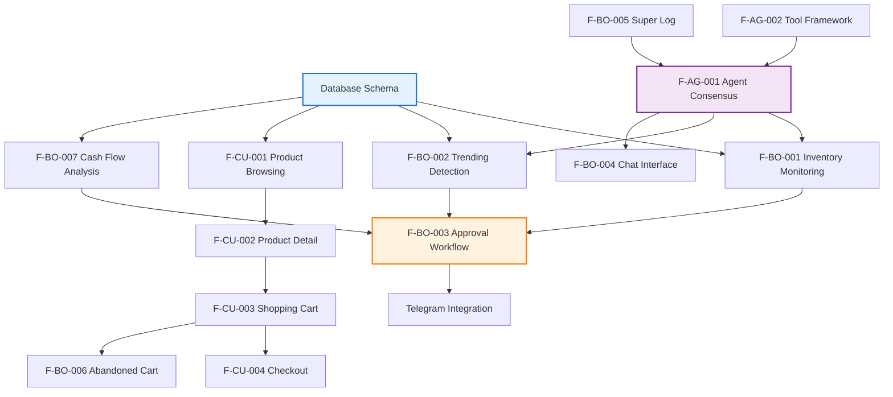

# Feature-Driven Documentation (FDD)

**Document Version:** 1.0  
**Last Updated:** February 12, 2026  
**Project:** OmniAgent Clothing Store

---

## Overview

This document defines all features from a user-centric perspective, organized by personas and user stories. Each feature includes acceptance criteria, priority levels, dependencies, and success metrics.

---

## User Personas

### Persona 1: Sarah - Solo Business Owner

**Background:**
- Runs a small online clothing store
- Manages all operations alone (buying, inventory, customer support, marketing)
- Limited technical skills
- Works 60+ hours per week
- Needs to make quick, informed decisions

**Goals:**
- Reduce time spent on data analysis
- Prevent stockouts and lost sales
- Respond quickly to customer inquiries
- Maintain work-life balance

**Pain Points:**
- Decision fatigue from juggling multiple roles
- Missing trends until it's too late
- Slow customer support response times
- Fear of making expensive mistakes (over-ordering, etc.)

### Persona 2: Alex - Online Shopper

**Background:**
- Millennial/Gen Z customer
- Shops online frequently
- Expects fast, intuitive shopping experience
- Values product variety and quick delivery

**Goals:**
- Find desired clothing items quickly
- Easy size and color selection
- Simple checkout process
- Track order status

**Pain Points:**
- Confusing product variants
- Items out of stock after adding to cart
- Slow or complicated checkout

---

## Feature Categories

1. [Business Owner Features](#business-owner-features)
2. [Customer Features](#customer-features)
3. [Agent System Features](#agent-system-features)

---

## Business Owner Features

### F-BO-001: Proactive Inventory Monitoring

**Priority:** P0 (Critical)

**User Story:**
> As a business owner, I want to be automatically alerted when inventory levels are low, so that I can restock before running out and losing sales.

**Acceptance Criteria:**
- [ ] System checks inventory levels hourly
- [ ] Alert triggered when any product variant drops below configured threshold
- [ ] Telegram notification includes product name, current quantity, and restock suggestion
- [ ] Alert includes estimated stockout date based on sales velocity
- [ ] User can configure custom thresholds per product category

**Dependencies:**
- Warden Agent implementation
- Inventory database schema
- Telegram integration

**Success Metrics:**
- Zero stockouts within first 3 months of operation
- 90% of restock alerts lead to preventive action
- Average response time to alerts < 1 hour

**Priority Justification:**
Stockouts directly impact revenue. This is the core value proposition of the system.

---

### F-BO-002: Trending Product Detection

**Priority:** P0 (Critical)

**User Story:**
> As a business owner, I want to be notified when a product starts selling faster than normal, so that I can capitalize on the trend and increase inventory.

**Acceptance Criteria:**
- [ ] System calculates baseline sales velocity for each product
- [ ] Alert triggered when sales exceed 3x baseline over 24-hour period
- [ ] Notification includes sales graph, current inventory, and restock recommendation
- [ ] Finance Agent validates budget availability before recommendation
- [ ] User can approve/reject restock with one tap in Telegram

**Dependencies:**
- Warden Agent with sales analytics
- Finance Agent for budget checks
- Executive Agent for consensus
- Historical sales data (minimum 7 days)

**Success Metrics:**
- Capture 80% of trending opportunities
- Zero missed sales due to trending stockouts
- 70% of trend alerts result in approved restock orders

---

### F-BO-003: Human-in-the-Loop Approval Workflow

**Priority:** P0 (Critical)

**User Story:**
> As a business owner, I want to review and approve all agent recommendations before they're executed, so that I maintain control over business decisions.

**Acceptance Criteria:**
- [ ] All agent recommendations require explicit approval
- [ ] Telegram inline buttons: [Approve] [Edit] [Reject]
- [ ] Clicking "Edit" allows modifying quantities/parameters
- [ ] Approval executes the action immediately
- [ ] Rejection logs reason and prevents execution
- [ ] Timeout after 24 hours reverts to "No Action"

**Dependencies:**
- Executive Agent
- Telegram Bot API integration
- Agent consensus mechanism

**Success Metrics:**
- 100% of actions require approval (no unauthorized executions)
- Average approval time < 15 minutes
- 85% approval rate on agent recommendations

---

### F-BO-004: Agentic Chat Interface

**Priority:** P1 (High)

**User Story:**
> As a business owner, I want to ask questions to my agents and get data-driven answers, so that I can make informed decisions quickly.

**Acceptance Criteria:**
- [ ] Web-based chat interface with message history
- [ ] User can type natural language questions
- [ ] Multiple agents can respond to single query
- [ ] Responses include citations (SQL queries, data sources)
- [ ] Can view "internal agent conversation" to see decision-making process
- [ ] Export chat history to PDF

**UI Requirements:**
- Clean, modern chat interface
- Agent avatars/names to distinguish speakers
- Expandable "thought trace" sections
- SQL query viewer with syntax highlighting
- Mobile-responsive design

**Dependencies:**
- All agents implemented
- Agent orchestrator
- Chat API endpoints
- WebSocket for real-time updates

**Success Metrics:**
- Owner uses chat daily for business queries
- 90% of questions answered within 30 seconds
- 80% user satisfaction with answer quality

---

### F-BO-005: Super Log Dashboard

**Priority:** P1 (High)

**User Story:**
> As a business owner, I want to see all agent activities in real-time, so that I can monitor system health and understand what actions are being taken.

**Acceptance Criteria:**
- [ ] Real-time event stream via WebSocket
- [ ] Filter by: agent type, event type, severity, date range
- [ ] Expandable event details with full metadata
- [ ] Agent status indicators (active, idle, error)
- [ ] System health metrics (LLM response time, database latency, error rate)
- [ ] Export logs to CSV

**Event Types to Display:**
- Agent started/stopped
- Query executed (with SQL)
- Alert sent
- Decision proposed
- Action approved/rejected
- Error occurred

**Dependencies:**
- Event bus implementation
- All agents logging events
- WebSocket server
- Frontend dashboard

**Success Metrics:**
- Owner checks log at least once per day
- 100% of agent activities logged
- Log load time < 2 seconds for 1000 events

---

### F-BO-006: Abandoned Cart Recovery

**Priority:** P1 (High)

**User Story:**
> As a business owner, I want to be alerted about high-value abandoned carts, so that I can reach out to customers and recover potential sales.

**Acceptance Criteria:**
- [ ] System detects carts with no activity for > 1 hour
- [ ] Only alerts for carts with value > $50
- [ ] Excludes carts with out-of-stock items
- [ ] Provides customer contact info (if available)
- [ ] Suggests discount percentage to offer
- [ ] Draft email/SMS message for approval

**Dependencies:**
- Warden Agent
- Support Agent for message drafting
- Cart tracking in database

**Success Metrics:**
- 30% cart recovery rate
- Average recovered cart value > $75
- Response time to abandoned cart < 2 hours

---

### F-BO-007: Cash Flow Analysis Before Restock

**Priority:** P0 (Critical)

**User Story:**
> As a business owner, I want the system to check my available budget before proposing restock orders, so that I don't overextend financially.

**Acceptance Criteria:**
- [ ] Finance Agent calculates current cash position from sales/expenses
- [ ] Checks if proposed order fits within available budget
- [ ] Warns if order will tighten cash flow below safety threshold
- [ ] Suggests alternative order quantities if needed
- [ ] Shows profit margin impact

**Dependencies:**
- Finance Agent implementation
- Financial data in database
- Integration with Warden's restock proposals

**Success Metrics:**
- Zero cash flow crises due to over-ordering
- 95% of recommendations are financially viable
- Finance Agent veto saves money 15% of the time

---

### F-BO-008: Customer Support Draft Responses

**Priority:** P1 (High)

**User Story:**
> As a business owner, I want agents to draft customer support responses based on actual order data, so that I can reply quickly without researching each case.

**Acceptance Criteria:**
- [ ] Support Agent queries order details from database
- [ ] Checks current inventory status
- [ ] Drafts professional, empathetic response
- [ ] Includes relevant information (tracking number, refund amount, etc.)
- [ ] User can edit before sending
- [ ] Learns from user edits over time

**Example Scenarios:**
- Order delayed: Draft apology with discount code
- Item out of stock: Suggest alternatives, offer refund
- Wrong item delivered: Draft apology, arrange replacement

**Dependencies:**
- Support Agent with email templates
- Order and inventory database access
- Integration with email system (future)

**Success Metrics:**
- 80% of drafts require minimal editing
- Support response time reduced by 60%
- Customer satisfaction score > 4.5/5

---

## Customer Features

### F-CU-001: Product Browsing & Filtering

**Priority:** P0 (Critical)

**User Story:**
> As a shopper, I want to browse clothing products and filter by category, size, color, and price, so that I can quickly find items I'm interested in.

**Acceptance Criteria:**
- [ ] Product grid displays thumbnails, name, price
- [ ] Filter sidebar with: category, size, color, brand, price range
- [ ] Filters update results in real-time without page reload
- [ ] "Sort by" options: Newest, Price (low-high), Price (high-low), Popular
- [ ] Display "Out of Stock" badge on unavailable items
- [ ] Mobile-responsive grid (1 column on mobile, 4 columns on desktop)

**UI Requirements:**
- Clean, modern e-commerce design
- High-quality product images
- Hover effect shows quick-view button
- Loading skeleton while fetching data

**Dependencies:**
- Products and variants database
- Category hierarchy
- Product images storage
- API endpoint for filtered queries

**Success Metrics:**
- 70% of visitors use at least one filter
- Average time to find desired product < 2 minutes
- Filter response time < 500ms

---

### F-CU-002: Product Detail & Variant Selection

**Priority:** P0 (Critical)

**User Story:**
> As a shopper, I want to view product details and select size/color variants, so that I can choose the exact item I want to purchase.

**Acceptance Criteria:**
- [ ] Product detail page shows multiple images (carousel/gallery)
- [ ] Description, materials, care instructions displayed
- [ ] Size selector (XS, S, M, L, XL, XXL) with availability indicators
- [ ] Color selector with color swatches
- [ ] Price updates based on selected variant
- [ ] Stock status: "In Stock", "Low Stock (X left)", "Out of Stock"
- [ ] Add to cart button disabled if out of stock
- [ ] Quantity selector (1-10)

**UI Requirements:**
- Image zoom on hover
- Selected variant highlighted
- Disabled variants grayed out
- Mobile-friendly touch controls

**Dependencies:**
- Product variants with SKU mapping
- Inventory tracking
- Image management system

**Success Metrics:**
- 90% of product page visits result in variant selection
- < 5% cart additions of out-of-stock variants (error prevention)
- Average time on product page: 1-2 minutes

---

### F-CU-003: Shopping Cart Management

**Priority:** P0 (Critical)

**User Story:**
> As a shopper, I want to add items to my cart, update quantities, and remove items, so that I can review my purchases before checkout.

**Acceptance Criteria:**
- [ ] Cart sidebar/page shows all added items
- [ ] Each item displays: image, name, size, color, price, quantity
- [ ] Update quantity with +/- buttons
- [ ] Remove item with delete icon
- [ ] Cart subtotal updates in real-time
- [ ] "Continue Shopping" and "Checkout" buttons
- [ ] Cart persists across browser sessions
- [ ] Out-of-stock warning if items become unavailable

**UI Requirements:**
- Slide-in cart sidebar on desktop
- Full-page cart on mobile
- Promo code input field
- Shipping estimate (optional)

**Dependencies:**
- Cart database tables
- Session management
- Real-time inventory checks

**Success Metrics:**
- 80% cart completion rate (cart → checkout)
- Average cart value > $75
- < 2% checkout failures due to inventory issues

---

### F-CU-004: Guest & Registered Checkout

**Priority:** P0 (Critical)

**User Story:**
> As a shopper, I want to complete my purchase with minimal friction, whether I have an account or not, so that I can quickly finalize my order.

**Acceptance Criteria:**
- [ ] Guest checkout option (no registration required)
- [ ] Registered user auto-fills shipping info
- [ ] 3-step checkout: Cart Review → Shipping → Payment
- [ ] Email capture on first step
- [ ] Shipping address form with validation
- [ ] Payment method selection (placeholder for future integration)
- [ ] Order confirmation page with order number
- [ ] Confirmation email sent immediately

**Checkout Steps:**
1. **Cart Review**: Final item review, promo code application
2. **Shipping Info**: Name, address, phone, email
3. **Payment**: Payment method (credit card, PayPal, etc.)
4. **Confirmation**: Order summary, order number, estimated delivery

**Dependencies:**
- Order creation workflow
- Email service integration
- Payment gateway integration (V2)

**Success Metrics:**
- 70% checkout completion rate
- Average checkout time < 3 minutes
- < 1% payment failures

---

### F-CU-005: Order History & Tracking

**Priority:** P2 (Medium)

**User Story:**
> As a registered customer, I want to view my past orders and track shipments, so that I know when my items will arrive.

**Acceptance Criteria:**
- [ ] "My Orders" page lists all past orders
- [ ] Each order shows: date, items, total, status
- [ ] Order detail page with item list and shipping info
- [ ] Order status: Processing, Shipped, Delivered, Cancelled
- [ ] Tracking number displayed when available
- [ ] "Reorder" button for easy repurchase

**Dependencies:**
- Customer authentication
- Order status workflow
- Shipping integration (V2)

**Success Metrics:**
- 60% of registered users check order history
- < 10% "where is my order" support tickets

---

## Agent System Features

### F-AG-001: Multi-Agent Consensus Mechanism

**Priority:** P0 (Critical)

**User Story:**
> As the system, agents must collaborate and reach consensus before proposing actions to the user, so that recommendations are well-vetted and balanced.

**Technical Requirements:**
- [ ] Shared state in Redis for inter-agent communication
- [ ] Message passing protocol between agents
- [ ] Voting mechanism for decisions
- [ ] Finance Agent has veto power on financial decisions
- [ ] Timeout if consensus not reached within 60 seconds
- [ ] Log all agent deliberations for transparency

**Consensus Algorithm:**
1. Warden Agent detects issue, proposes action
2. Warden broadcasts to Finance, Architect agents
3. Finance analyzes budget impact, votes approve/concern
4. Architect validates data accuracy, provides evidence
5. If majority approve, Executive formats user notification
6. If Finance vetoes, proposal rejected with explanation

**Dependencies:**
- Redis pub/sub
- All agents implemented
- Event logging system

**Success Metrics:**
- 100% of proposals go through consensus
- Average consensus time < 15 seconds
- < 5% proposals fail consensus (indicating healthy checks)

---

### F-AG-002: Agent Tool Execution Framework

**Priority:** P0 (Critical)

**Technical Requirements:**
- [ ] Tool registry system
- [ ] SQL query tool with safety validation
- [ ] HTTP request tool for external APIs
- [ ] Telegram notification tool
- [ ] Email composition tool
- [ ] Calculation/analytics tool
- [ ] Tool execution logging
- [ ] Error handling and retry logic

**Safety Features:**
- SQL queries restricted to read-only (except Executive Agent)
- Query timeout limits (5 seconds max)
- Input sanitization to prevent injection
- Rate limiting on external API calls

**Dependencies:**
- Agent framework (LangGraph/CrewAI)
- Database connection pool
- Telegram Bot API client

**Success Metrics:**
- 99.9% tool execution success rate
- Zero SQL injection vulnerabilities
- All tool executions logged

---

### F-AG-003: Scheduled Agent Tasks

**Priority:** P1 (High)

**Technical Requirements:**
- [ ] Celery Beat scheduler integration
- [ ] Hourly inventory checks (Warden)
- [ ] Daily sales report (Architect)
- [ ] Weekly financial summary (Finance)
- [ ] Abandoned cart check every 30 minutes (Warden)
- [ ] System health check every 5 minutes
- [ ] Task status monitoring

**Scheduled Tasks:**

| Task | Agent | Frequency | Purpose |
|------|-------|-----------|---------|
| Inventory Check | Warden | Hourly | Detect low stock |
| Sales Analysis | Warden | Daily | Identify trends |
| Cart Abandonment | Warden | 30 min | Recovery opportunities |
| Financial Summary | Finance | Weekly | Cash flow overview |
| System Health | Executive | 5 min | Monitor errors |

**Dependencies:**
- Celery with Redis broker
- Background worker processes
- Task queue monitoring

**Success Metrics:**
- 99% task execution reliability
- Average task completion time < 30 seconds
- Zero missed scheduled tasks

---

### F-AG-004: Agent Learning & Improvement

**Priority:** P2 (Medium - Future Enhancement)

**User Story:**
> As the system, agents should learn from user feedback to improve recommendation quality over time.

**Technical Requirements:**
- [ ] Track approval/rejection rates per agent
- [ ] Store user edits to agent suggestions
- [ ] Feedback loop to adjust thresholds
- [ ] A/B testing for recommendation strategies
- [ ] Model fine-tuning based on historical decisions

**Dependencies:**
- Historical decision database
- ML pipeline (future)
- Ollama model fine-tuning capabilities

**Success Metrics:**
- 10% improvement in approval rate over 3 months
- User satisfaction score increases over time

---

## Feature Dependency Map

---

## Implementation Roadmap

### Phase 1: Foundation (Weeks 1-2)
**Goal:** Core infrastructure and basic e-commerce

- Database schema implementation
- API server setup
- Basic shop page (browse, detail, cart)
- Agent framework scaffolding

### Phase 2: Agent System (Weeks 3-4)
**Goal:** Intelligent monitoring and recommendations

- Warden Agent (inventory + trending)
- Finance Agent (budget checks)
- Architect Agent (SQL queries)
- Executive Agent (consensus + Telegram)
- Agent consensus mechanism

### Phase 3: Business Owner Tools (Weeks 5-6)
**Goal:** Owner interface and approval workflow

- Agentic chat interface
- Super Log dashboard
- Telegram approval workflow
- Scheduled agent tasks

### Phase 4: Advanced Features (Weeks 7-8)
**Goal:** Polish and additional capabilities

- Abandoned cart recovery
- Customer support drafts
- Checkout completion
- Order management
- Performance optimization

### Phase 5: Testing & Deployment (Week 9)
**Goal:** Production readiness

- End-to-end testing
- Load testing
- Security audit
- Deployment setup
- User training

---

## Success Criteria Summary

| Feature Category | Key Metric | Target |
|-----------------|------------|--------|
| Inventory Management | Stockouts prevented | 100% |
| Trend Capture | Trending opportunities captured | 80% |
| Owner Productivity | Time savings on data analysis | 75% |
| Customer Experience | Checkout completion rate | 70% |
| Agent Reliability | Consensus success rate | 95% |
| System Performance | API response time | <200ms |
| User Satisfaction | Owner NPS score | >70 |

---

## Document Cross-References

- **System Overview**: [`01-system-overview.md`](./01-system-overview.md)
- **Technical Design**: [`03-technical-design.md`](./03-technical-design.md)
- **Data Models**: [`04-data-model.md`](./04-data-model.md)
- **API Specifications**: [`05-api-specification.md`](./05-api-specification.md)

---

## Version History

| Version | Date | Author | Changes |
|---------|------|--------|---------|
| 1.0 | 2026-02-12 | System | Initial feature-driven documentation |

---

*This document defines what the system should do. For how it will be built, refer to the Technical Design Document.*
