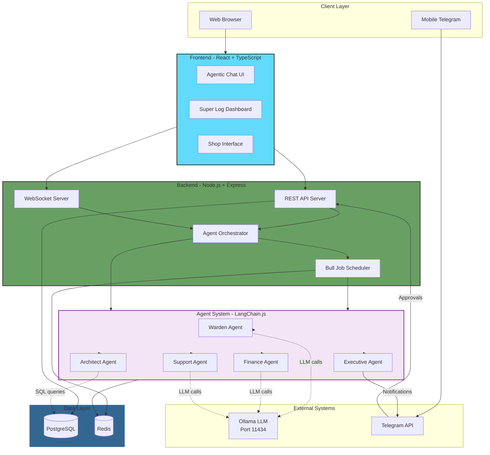
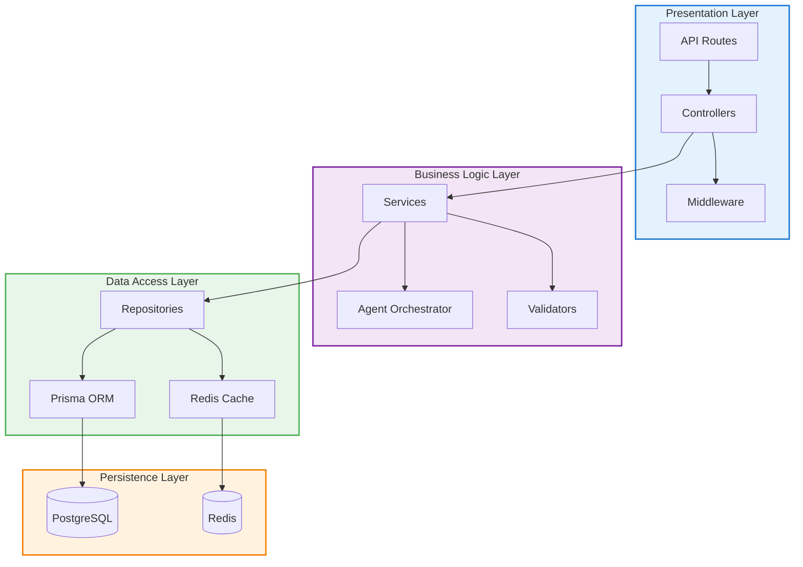
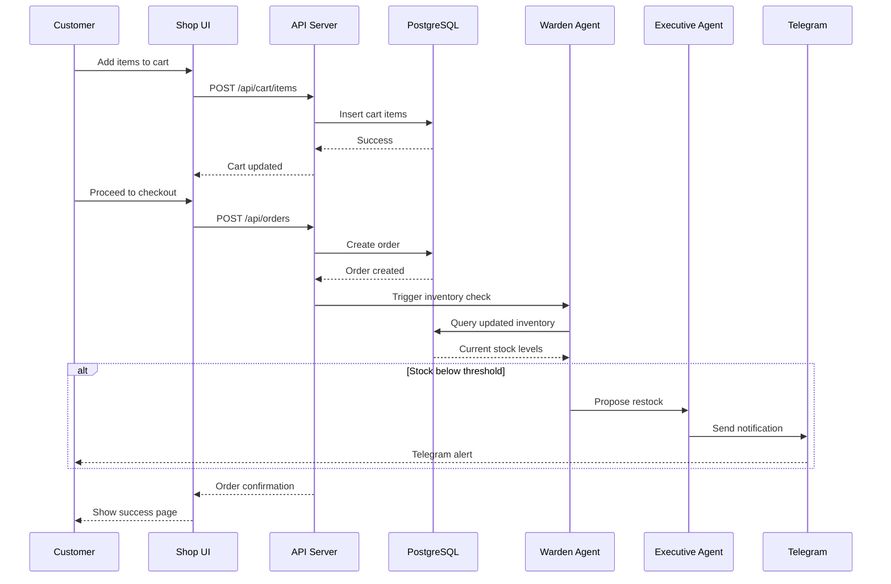
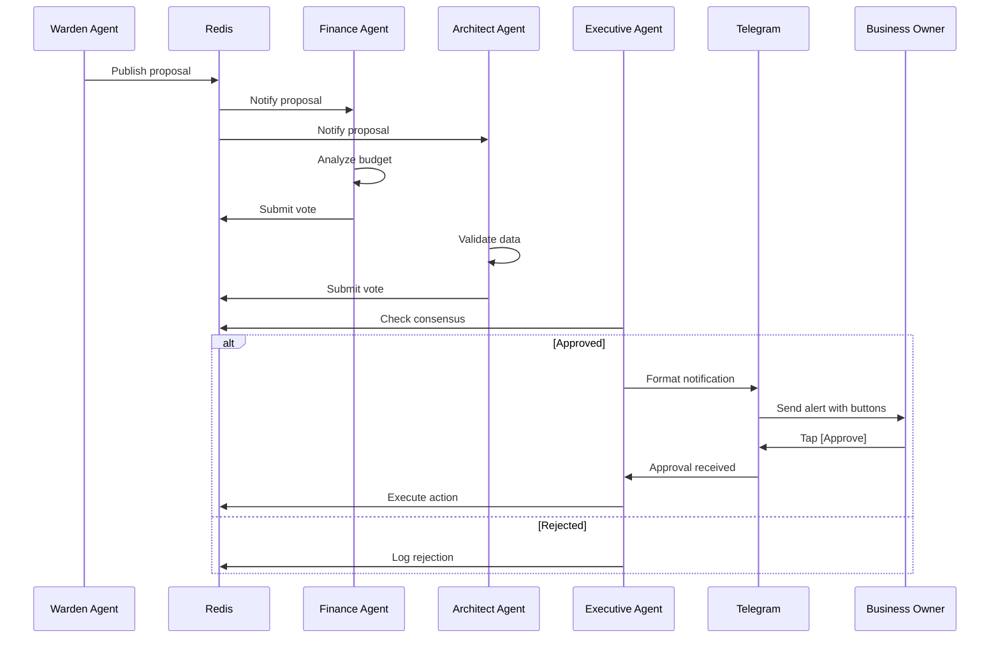
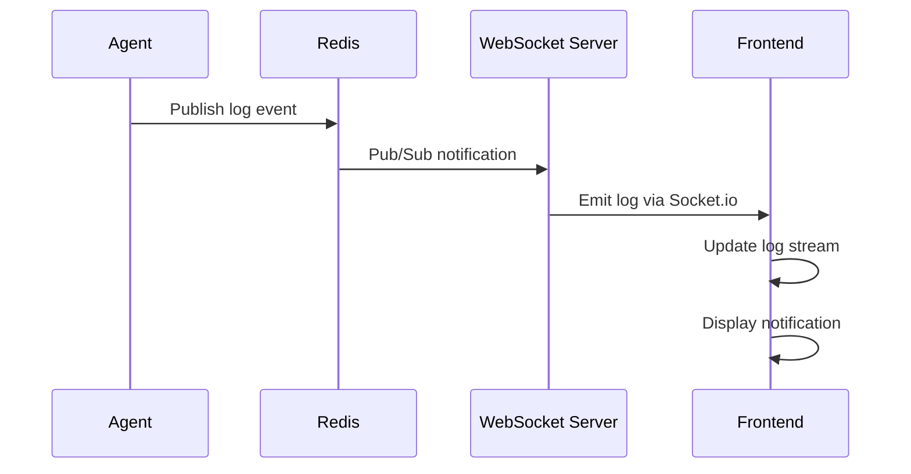

# Technical Design Document (TDD)

**Document Version:** 1.0  
**Last Updated:** February 12, 2026  
**Project:** OmniAgent Clothing Store

---

## Overview

This document provides detailed technical architecture, component design, technology stack, and implementation guidelines for the OmniAgent Clothing Store system built on Node.js.

---

## Technology Stack

### Why LangGraph.js?

**LangGraph.js** is chosen as the agent framework because it's specifically designed for **multi-agent workflows** with complex interactions:

✅ **Graph-Based Orchestration:** Agents are nodes, decisions are edges - perfect for consensus workflows  
✅ **Built-in State Management:** Automatic state tracking across agents (no manual Redis juggling)  
✅ **Conditional Routing:** "If Finance approves → Executive; else → End" logic is native  
✅ **Human-in-the-Loop:** Built-in support for approval interrupts  
✅ **Streaming:** Real-time agent thought streams to frontend  
✅ **Simple API:** Easier to build and debug than custom orchestration  

**Installation:**
```bash
npm install @langchain/langgraph @langchain/ollama
```

### Backend Stack (Node.js)

| Component | Technology | Version | Purpose |
|-----------|-----------|---------|---------|
| **Runtime** | Node.js | 20.x LTS | JavaScript runtime environment |
| **Framework** | Express.js | 4.x | REST API server |
| **Language** | TypeScript | 5.x | Type-safe JavaScript |
| **Agent Framework** | LangGraph.js | 0.2.x | Multi-agent workflow orchestration |
| **ORM** | Prisma | 5.x | Database abstraction layer |
| **Validation** | Zod | 3.x | Schema validation |
| **Queue** | Bull | 4.x | Background job processing |
| **WebSocket** | Socket.io | 4.x | Real-time bidirectional communication |
| **Testing** | Jest + Supertest | Latest | Unit and integration testing |
| **API Docs** | Swagger/OpenAPI | 3.x | API documentation |

### Frontend Stack

| Component | Technology | Version | Purpose |
|-----------|-----------|---------|---------|
| **Framework** | React.js | 18.x | UI library |
| **Language** | TypeScript | 5.x | Type-safe development |
| **Styling** | Tailwind CSS | 3.x | Utility-first CSS |
| **State** | Zustand | 4.x | Lightweight state management |
| **Forms** | React Hook Form | 7.x | Form handling |
| **HTTP Client** | Axios | 1.x | API requests |
| **WebSocket** | Socket.io-client | 4.x | Real-time updates |
| **Build Tool** | Vite | 5.x | Fast development and build |
| **Testing** | Vitest + Testing Library | Latest | Component testing |

### Data & Infrastructure

| Component | Technology | Version | Purpose |
|-----------|-----------|---------|---------|
| **Database** | SQLite | 3.x | File-based transactional data storage |
| **Cache** | Redis | 7.x | Session, cache, job queue |
| **LLM** | Ollama | Latest | Local AI model inference (phi4-mini:latest) |
| **Process Manager** | PM2 | 5.x | Production process management |
| **Reverse Proxy** | Nginx | Latest | Load balancing, SSL termination |

### External Services

| Service | Purpose | Integration |
|---------|---------|-------------|
| **Telegram Bot API** | Mobile notifications & approvals | node-telegram-bot-api |
| **Ollama API** | Local LLM inference | HTTP REST API |

---

## System Architecture

### High-Level Architecture Diagram



---

## Architecture Patterns

### 1. Layered Architecture



### 2. Event-Driven Architecture

The system uses an event-driven approach for agent communication and real-time updates:

```typescript
// Event Bus Pattern
class EventBus {
  private redis: Redis;
  
  async publish(channel: string, event: AgentEvent): Promise<void>;
  async subscribe(channel: string, handler: EventHandler): Promise<void>;
  async unsubscribe(channel: string): Promise<void>;
}

// Example Events
interface AgentEvent {
  id: string;
  type: 'ALERT' | 'DECISION' | 'ACTION' | 'ERROR';
  agentId: string;
  timestamp: Date;
  payload: any;
  metadata?: Record<string, any>;
}
```

### 3. Repository Pattern

Separates data access logic from business logic:

```typescript
// Generic Repository Interface
interface IRepository<T> {
  findById(id: string): Promise<T | null>;
  findAll(filter?: any): Promise<T[]>;
  create(data: Partial<T>): Promise<T>;
  update(id: string, data: Partial<T>): Promise<T>;
  delete(id: string): Promise<boolean>;
}

// Example: Product Repository
class ProductRepository implements IRepository<Product> {
  constructor(private prisma: PrismaClient) {}
  
  async findWithVariants(id: string): Promise<ProductWithVariants | null> {
    return this.prisma.product.findUnique({
      where: { id },
      include: { variants: true, category: true }
    });
  }
}
```

---

## Component Design

### Backend Components

#### 1. API Server (Express.js)

**File Structure:**
```
src/
├── server.ts                 # Entry point
├── app.ts                    # Express app configuration
├── config/
│   ├── database.ts          # Prisma configuration
│   ├── redis.ts             # Redis connection
│   ├── telegram.ts          # Telegram bot setup
│   └── ollama.ts            # Ollama client config
├── routes/
│   ├── products.routes.ts   # Product endpoints
│   ├── cart.routes.ts       # Cart endpoints
│   ├── orders.routes.ts     # Order endpoints
│   ├── chat.routes.ts       # Agent chat endpoints
│   ├── agents.routes.ts     # Agent management
│   └── logs.routes.ts       # Log retrieval
├── controllers/
│   ├── products.controller.ts
│   ├── cart.controller.ts
│   ├── orders.controller.ts
│   ├── chat.controller.ts
│   └── agents.controller.ts
├── services/
│   ├── product.service.ts
│   ├── cart.service.ts
│   ├── order.service.ts
│   └── agent-orchestrator.service.ts
├── repositories/
│   ├── product.repository.ts
│   ├── cart.repository.ts
│   └── order.repository.ts
├── middleware/
│   ├── auth.middleware.ts
│   ├── validation.middleware.ts
│   ├── error.middleware.ts
│   └── rate-limit.middleware.ts
├── agents/
│   ├── base-agent.ts
│   ├── warden-agent.ts
│   ├── finance-agent.ts
│   ├── architect-agent.ts
│   ├── support-agent.ts
│   └── executive-agent.ts
├── tools/
│   ├── sql-query.tool.ts
│   ├── telegram.tool.ts
│   ├── analytics.tool.ts
│   └── email.tool.ts
├── utils/
│   ├── logger.ts
│   ├── redis-client.ts
│   └── validation.ts
└── types/
    ├── agent.types.ts
    ├── api.types.ts
    └── db.types.ts
```

**Key Modules:**

```typescript
// src/app.ts
import express from 'express';
import cors from 'cors';
import helmet from 'helmet';
import { errorMiddleware } from './middleware/error.middleware';
import productRoutes from './routes/products.routes';
import chatRoutes from './routes/chat.routes';

export function createApp() {
  const app = express();
  
  // Middleware
  app.use(helmet());
  app.use(cors());
  app.use(express.json());
  
  // Routes
  app.use('/api/products', productRoutes);
  app.use('/api/chat', chatRoutes);
  
  // Error handling
  app.use(errorMiddleware);
  
  return app;
}
```

```typescript
// src/server.ts
import { createApp } from './app';
import { createServer } from 'http';
import { Server } from 'socket.io';
import { prisma } from './config/database';
import { initializeAgents } from './agents';

const PORT = process.env.PORT || 8000;

async function bootstrap() {
  const app = createApp();
  const httpServer = createServer(app);
  const io = new Server(httpServer, {
    cors: { origin: process.env.FRONTEND_URL }
  });
  
  // Initialize WebSocket handlers
  io.on('connection', (socket) => {
    console.log('Client connected:', socket.id);
    
    socket.on('subscribe:logs', () => {
      socket.join('agent-logs');
    });
  });
  
  // Initialize agents
  await initializeAgents(io);
  
  // Start server
  httpServer.listen(PORT, () => {
    console.log(`Server running on port ${PORT}`);
  });
}

bootstrap().catch(console.error);
```

#### 2. Agent Orchestrator

**Core Orchestrator Service:**

```typescript
// src/services/agent-orchestrator.service.ts
import { Redis } from 'ioredis';
import { BaseAgent } from '../agents/base-agent';
import { WardenAgent } from '../agents/warden-agent';
import { FinanceAgent } from '../agents/finance-agent';
import { Server as SocketServer } from 'socket.io';

export class AgentOrchestrator {
  private agents: Map<string, BaseAgent>;
  private redis: Redis;
  private io: SocketServer;
  
  constructor(redis: Redis, io: SocketServer) {
    this.redis = redis;
    this.io = io;
    this.agents = new Map();
    
    // Initialize agents
    this.agents.set('warden', new WardenAgent(redis));
    this.agents.set('finance', new FinanceAgent(redis));
    // ... other agents
  }
  
  async handleUserMessage(message: string, userId: string): Promise<string> {
    // Log event
    await this.logEvent({
      type: 'USER_MESSAGE',
      message,
      userId,
      timestamp: new Date()
    });
    
    // Determine which agents should respond
    const relevantAgents = await this.routeToAgents(message);
    
    // Collect agent responses
    const responses = await Promise.all(
      relevantAgents.map(agent => agent.process(message))
    );
    
    // Aggregate and format response
    return this.formatResponse(responses);
  }
  
  async proposeDecision(proposal: DecisionProposal): Promise<void> {
    // Initiate consensus process
    const consensusId = await this.startConsensus(proposal);
    
    // Notify relevant agents
    await this.notifyAgentsForConsensus(consensusId, proposal);
    
    // Wait for votes (with timeout)
    const result = await this.waitForConsensus(consensusId, 60000);
    
    if (result.approved) {
      // Send to Executive Agent for user notification
      const executive = this.agents.get('executive') as ExecutiveAgent;
      await executive.notifyUser(proposal, result);
    }
  }
  
  private async logEvent(event: AgentEvent): Promise<void> {
    // Store in Redis
    await this.redis.lpush('agent:events', JSON.stringify(event));
    
    // Emit to WebSocket clients
    this.io.to('agent-logs').emit('log', event);
  }
}
```

#### 3. Agent State Schema (LangGraph)

```typescript
// src/agents/types.ts
import { Annotation } from '@langchain/langgraph';

// Define shared state for agent workflow
export const AgentState = Annotation.Root({
  // User input
  input: Annotation<string>,
  
  // Agent responses
  wardenAnalysis: Annotation<any>,
  financeApproval: Annotation<any>,
  architectData: Annotation<any>,
  supportDraft: Annotation<any>,
  
  // Decision tracking
  decision: Annotation<{
    id: string;
    type: string;
    data: any;
    votes: Array<{ agent: string; approve: boolean; reasoning: string }>;
    status: 'pending' | 'approved' | 'rejected';
  }>,
  
  // Messages and logs
  messages: Annotation<Array<any>>,
  logs: Annotation<Array<string>>
});
```

#### 4. LangGraph Agent Workflow

```typescript
// src/agents/agent-graph.ts
import { StateGraph, END } from '@langchain/langgraph';
import { ChatOllama } from '@langchain/ollama';
import { AgentState } from './types';

// Initialize Ollama model
const llm = new ChatOllama({
  model: 'phi4-mini:latest',
  baseUrl: 'http://localhost:11434',
  temperature: 0.7,
});

// Create the agent workflow graph
export function createAgentGraph() {
  const workflow = new StateGraph(AgentState);
  
  // Define agent nodes
  workflow.addNode('warden', wardenNode);
  workflow.addNode('finance', financeNode);
  workflow.addNode('architect', architectNode);
  workflow.addNode('support', supportNode);
  workflow.addNode('executive', executiveNode);
  workflow.addNode('consensus', consensusNode);
  
  // Define workflow edges
  workflow.setEntryPoint('warden');
  workflow.addEdge('warden', 'architect'); // Warden requests data from Architect
  workflow.addEdge('architect', 'finance'); // Finance analyzes budget
  workflow.addEdge('finance', 'consensus'); // Check consensus
  
  // Conditional edge: If consensus reached, go to Executive
  workflow.addConditionalEdges(
    'consensus',
    (state) => state.decision.status === 'approved' ? 'executive' : END,
    {
      executive: 'executive',
      [END]: END,
    }
  );
  
  workflow.addEdge('executive', END);
  
  return workflow.compile();
}

// Node implementations
async function wardenNode(state: typeof AgentState.State) {
  const analysis = await llm.invoke([
    { role: 'system', content: WARDEN_SYSTEM_PROMPT },
    { role: 'user', content: state.input }
  ]);
  
  return {
    wardenAnalysis: analysis.content,
    logs: [...state.logs, `Warden: ${analysis.content}`]
  };
}

async function financeNode(state: typeof AgentState.State) {
  const budgetCheck = await llm.invoke([
    { role: 'system', content: FINANCE_SYSTEM_PROMPT },
    { role: 'user', content: `Review this proposal: ${JSON.stringify(state.wardenAnalysis)}` }
  ]);
  
  return {
    financeApproval: budgetCheck.content,
    logs: [...state.logs, `Finance: ${budgetCheck.content}`]
  };
}

async function consensusNode(state: typeof AgentState.State) {
  // Simple consensus logic
  const approved = state.financeApproval?.includes('APPROVED');
  
  return {
    decision: {
      ...state.decision,
      status: approved ? 'approved' : 'rejected',
      votes: [
        { agent: 'warden', approve: true, reasoning: 'Initiated proposal' },
        { agent: 'finance', approve: approved, reasoning: state.financeApproval }
      ]
    }
  };
}

async function executiveNode(state: typeof AgentState.State) {
  // Send Telegram notification
  await sendTelegramNotification(state.decision);
  
  return {
    logs: [...state.logs, 'Executive: Notification sent to user']
  };
}
```

#### 5. Using the Agent Graph

```typescript
// src/services/agent.service.ts
import { createAgentGraph } from '../agents/agent-graph';

export class AgentService {
  private graph = createAgentGraph();
  
  async processUserQuery(input: string) {
    const initialState = {
      input,
      messages: [],
      logs: [],
      decision: {
        id: `decision_${Date.now()}`,
        type: 'user_query',
        data: {},
        votes: [],
        status: 'pending' as const
      }
    };
    
    const result = await this.graph.invoke(initialState);
    
    return {
      response: result.logs.join('\n'),
      decision: result.decision,
      fullState: result
    };
  }
  
  async checkInventory() {
    const initialState = {
      input: 'Check inventory levels and identify low stock items',
      messages: [],
      logs: [],
      decision: {
        id: `inventory_${Date.now()}`,
        type: 'inventory_check',
        data: {},
        votes: [],
        status: 'pending' as const
      }
    };
    
    return await this.graph.invoke(initialState);
  }
}
  
  async checkInventoryLevels(): Promise<InventoryAlert[]> {
    await this.log('Starting inventory check');
    
    // Query inventory using SQL tool
    const sqlTool = this.tools[0] as SQLQueryTool;
    const result = await sqlTool.execute(`
      SELECT 
        pv.id, pv.sku, p.name, pv.size, pv.color, i.quantity,
        AVG(oi.quantity) as avg_daily_sales
      FROM product_variants pv
      JOIN products p ON pv.product_id = p.id
      JOIN inventory i ON i.variant_id = pv.id
      LEFT JOIN order_items oi ON oi.variant_id = pv.id
      WHERE oi.created_at > NOW() - INTERVAL '7 days'
      GROUP BY pv.id, i.quantity
      HAVING i.quantity < 20
    `);
    
    const alerts: InventoryAlert[] = [];
    
    for (const item of result.rows) {
      const daysUntilStockout = item.quantity / (item.avg_daily_sales || 1);
      
      if (daysUntilStockout < 7) {
        alerts.push({
          variantId: item.id,
          sku: item.sku,
          productName: item.name,
          currentStock: item.quantity,
          daysUntilStockout,
          severity: daysUntilStockout < 3 ? 'critical' : 'warning'
        });
      }
    }
    
    if (alerts.length > 0) {
      // Propose restock decision
      await this.proposeRestock(alerts);
    }
    
    return alerts;
  }
  
  private async proposeRestock(alerts: InventoryAlert[]): Promise<void> {
    // Create proposal
    const proposal = {
      type: 'RESTOCK',
      proposedBy: this.name,
      data: alerts,
      requiredApprovers: ['finance', 'executive'],
      timestamp: new Date()
    };
    
    await this.redis.set(
      `proposal:${Date.now()}`,
      JSON.stringify(proposal),
      'EX',
      3600 // Expire in 1 hour
    );
    
    // Notify orchestrator
    await this.redis.publish('agent:proposals', JSON.stringify(proposal));
  }
  
  private getSystemPrompt(): string {
    return `You are the Warden Agent, responsible for monitoring inventory levels, 
    detecting sales trends, and identifying potential issues. Your goal is to 
    proactively alert the business owner to opportunities and risks.`;
  }
}
```

#### 5. Job Scheduler (Bull)

```typescript
// src/jobs/scheduler.ts
import Bull from 'bull';
import { Redis } from 'ioredis';
import { WardenAgent } from '../agents/warden-agent';

const redis = new Redis(process.env.REDIS_URL);

// Create job queues
export const inventoryCheckQueue = new Bull('inventory-check', {
  redis: { 
    host: process.env.REDIS_HOST,
    port: parseInt(process.env.REDIS_PORT || '6379')
  }
});

export const salesAnalysisQueue = new Bull('sales-analysis', {
  redis: { 
    host: process.env.REDIS_HOST,
    port: parseInt(process.env.REDIS_PORT || '6379')
  }
});

// Define job processors
inventoryCheckQueue.process(async (job) => {
  const warden = new WardenAgent(redis);
  const alerts = await warden.checkInventoryLevels();
  
  return { alertCount: alerts.length, alerts };
});

salesAnalysisQueue.process(async (job) => {
  const warden = new WardenAgent(redis);
  const trends = await warden.analyzeSalesTrends();
  
  return { trendCount: trends.length, trends };
});

// Schedule recurring jobs
export function initializeScheduledJobs() {
  // Inventory check every hour
  inventoryCheckQueue.add({}, {
    repeat: { cron: '0 * * * *' }
  });
  
  // Sales analysis every 6 hours
  salesAnalysisQueue.add({}, {
    repeat: { cron: '0 */6 * * *' }
  });
  
  // Abandoned cart check every 30 minutes
  inventoryCheckQueue.add({ type: 'abandoned-carts' }, {
    repeat: { cron: '*/30 * * * *' }
  });
}
```

---

## Frontend Components

### Application Structure

```
frontend/
├── src/
│   ├── App.tsx
│   ├── main.tsx
│   ├── pages/
│   │   ├── ShopPage.tsx
│   │   ├── ProductDetailPage.tsx
│   │   ├── CartPage.tsx
│   │   ├── CheckoutPage.tsx
│   │   ├── ChatPage.tsx
│   │   └── SuperLogPage.tsx
│   ├── components/
│   │   ├── shop/
│   │   │   ├── ProductGrid.tsx
│   │   │   ├── ProductCard.tsx
│   │   │   ├── FilterSidebar.tsx
│   │   │   └── VariantSelector.tsx
│   │   ├── chat/
│   │   │   ├── ChatInterface.tsx
│   │   │   ├── MessageBubble.tsx
│   │   │   ├── AgentIndicator.tsx
│   │   │   └── ThoughtTrace.tsx
│   │   ├── logs/
│   │   │   ├── LogStream.tsx
│   │   │   ├── LogEntry.tsx
│   │   │   ├── LogFilters.tsx
│   │   │   └── AgentStatusCard.tsx
│   │   └── common/
│   │       ├── Button.tsx
│   │       ├── Input.tsx
│   │       ├── Modal.tsx
│   │       └── Spinner.tsx
│   ├── hooks/
│   │   ├── useWebSocket.ts
│   │   ├── useCart.ts
│   │   ├── useProducts.ts
│   │   └── useChat.ts
│   ├── stores/
│   │   ├── cartStore.ts
│   │   ├── chatStore.ts
│   │   └── authStore.ts
│   ├── services/
│   │   ├── api.service.ts
│   │   ├── socket.service.ts
│   │   └── auth.service.ts
│   ├── types/
│   │   ├── product.types.ts
│   │   ├── cart.types.ts
│   │   ├── agent.types.ts
│   │   └── api.types.ts
│   └── utils/
│       ├── formatters.ts
│       └── validators.ts
└── public/
    └── assets/
```

### Key Frontend Components

#### 1. Agentic Chat Interface

```typescript
// src/components/chat/ChatInterface.tsx
import React, { useEffect, useState } from 'react';
import { useWebSocket } from '../../hooks/useWebSocket';
import { useChatStore } from '../../stores/chatStore';
import { MessageBubble } from './MessageBubble';
import { ThoughtTrace } from './ThoughtTrace';

export const ChatInterface: React.FC = () => {
  const { messages, sendMessage, loading } = useChatStore();
  const [input, setInput] = useState('');
  const socket = useWebSocket();
  
  useEffect(() => {
    socket.on('agent:response', (response) => {
      useChatStore.getState().addMessage(response);
    });
  }, [socket]);
  
  const handleSubmit = (e: React.FormEvent) => {
    e.preventDefault();
    if (!input.trim()) return;
    
    sendMessage(input);
    setInput('');
  };
  
  return (
    <div className="flex flex-col h-screen bg-gray-50">
      <div className="flex-1 overflow-y-auto p-4 space-y-4">
        {messages.map((msg) => (
          <div key={msg.id}>
            <MessageBubble message={msg} />
            {msg.thoughtTrace && (
              <ThoughtTrace trace={msg.thoughtTrace} />
            )}
          </div>
        ))}
      </div>
      
      <form onSubmit={handleSubmit} className="p-4 bg-white border-t">
        <div className="flex gap-2">
          <input
            type="text"
            value={input}
            onChange={(e) => setInput(e.target.value)}
            placeholder="Ask your agents anything..."
            className="flex-1 px-4 py-2 border rounded-lg"
            disabled={loading}
          />
          <button
            type="submit"
            disabled={loading}
            className="px-6 py-2 bg-blue-600 text-white rounded-lg"
          >
            Send
          </button>
        </div>
      </form>
    </div>
  );
};
```

#### 2. Super Log Dashboard

```typescript
// src/components/logs/LogStream.tsx
import React, { useEffect, useState } from 'react';
import { useWebSocket } from '../../hooks/useWebSocket';
import { LogEntry } from './LogEntry';

export const LogStream: React.FC = () => {
  const [logs, setLogs] = useState<AgentLog[]>([]);
  const [filters, setFilters] = useState({
    agent: 'all',
    severity: 'all',
    type: 'all'
  });
  const socket = useWebSocket();
  
  useEffect(() => {
    // Subscribe to real-time logs
    socket.emit('subscribe:logs');
    
    socket.on('log', (newLog: AgentLog) => {
      setLogs(prev => [newLog, ...prev].slice(0, 100));
    });
    
    return () => {
      socket.off('log');
    };
  }, [socket]);
  
  const filteredLogs = logs.filter(log => {
    if (filters.agent !== 'all' && log.agentId !== filters.agent) return false;
    if (filters.severity !== 'all' && log.severity !== filters.severity) return false;
    if (filters.type !== 'all' && log.type !== filters.type) return false;
    return true;
  });
  
  return (
    <div className="h-screen flex flex-col">
      <div className="p-4 bg-white border-b">
        <h1 className="text-2xl font-bold mb-4">Super Log</h1>
        {/* Filters */}
      </div>
      
      <div className="flex-1 overflow-y-auto p-4 bg-gray-50">
        {filteredLogs.map(log => (
          <LogEntry key={log.id} log={log} />
        ))}
      </div>
    </div>
  );
};
```

#### 3. Shop Page

```typescript
// src/pages/ShopPage.tsx
import React, { useEffect, useState } from 'react';
import { ProductGrid } from '../components/shop/ProductGrid';
import { FilterSidebar } from '../components/shop/FilterSidebar';
import { useProducts } from '../hooks/useProducts';

export const ShopPage: React.FC = () => {
  const [filters, setFilters] = useState({
    category: [],
    size: [],
    color: [],
    priceRange: [0, 1000],
    brand: []
  });
  
  const { products, loading, error } = useProducts(filters);
  
  return (
    <div className="container mx-auto px-4 py-8">
      <div className="flex gap-8">
        <aside className="w-64 flex-shrink-0">
          <FilterSidebar
            filters={filters}
            onFilterChange={setFilters}
          />
        </aside>
        
        <main className="flex-1">
          <div className="mb-6">
            <h1 className="text-3xl font-bold">Clothing Store</h1>
            <p className="text-gray-600">
              {products.length} products found
            </p>
          </div>
          
          {loading && <div>Loading...</div>}
          {error && <div>Error: {error.message}</div>}
          {products && <ProductGrid products={products} />}
        </main>
      </div>
    </div>
  );
};
```

---

## Data Flow Diagrams

### 1. User Places Order Flow



### 2. Agent Consensus Flow



### 3. Real-time Log Streaming



---

## Error Handling Strategy

### 1. API Error Responses

```typescript
// src/middleware/error.middleware.ts
export class AppError extends Error {
  constructor(
    public statusCode: number,
    public message: string,
    public isOperational: boolean = true
  ) {
    super(message);
  }
}

export const errorMiddleware = (
  err: Error,
  req: Request,
  res: Response,
  next: NextFunction
) => {
  if (err instanceof AppError) {
    return res.status(err.statusCode).json({
      status: 'error',
      message: err.message
    });
  }
  
  // Log unexpected errors
  console.error('Unexpected error:', err);
  
  return res.status(500).json({
    status: 'error',
    message: 'Internal server error'
  });
};
```

### 2. Agent Error Recovery

```typescript
// Agent with retry logic
async process(input: string): Promise<AgentResponse> {
  const maxRetries = 3;
  let lastError: Error;
  
  for (let attempt = 1; attempt <= maxRetries; attempt++) {
    try {
      return await this.executeProcess(input);
    } catch (error) {
      lastError = error;
      await this.log(`Attempt ${attempt} failed: ${error.message}`);
      
      if (attempt < maxRetries) {
        await this.delay(1000 * attempt); // Exponential backoff
      }
    }
  }
  
  throw new Error(`Agent failed after ${maxRetries} attempts: ${lastError.message}`);
}
```

---

## Performance Optimization

### 1. Database Query Optimization

- **Connection Pooling**: Prisma connection pool size: 10
- **Query Optimization**: Use `select` to fetch only needed fields
- **Indexing**: Create indexes on frequently queried columns
- **Caching**: Redis cache for product lists, categories (TTL: 5 minutes)

### 2. API Response Caching

```typescript
// src/middleware/cache.middleware.ts
import { Redis } from 'ioredis';

export const cacheMiddleware = (ttl: number) => {
  return async (req: Request, res: Response, next: NextFunction) => {
    const key = `cache:${req.originalUrl}`;
    const cached = await redis.get(key);
    
    if (cached) {
      return res.json(JSON.parse(cached));
    }
    
    // Override res.json to cache response
    const originalJson = res.json.bind(res);
    res.json = (body: any) => {
      redis.setex(key, ttl, JSON.stringify(body));
      return originalJson(body);
    };
    
    next();
  };
};

// Usage
app.get('/api/products', cacheMiddleware(300), productController.list);
```

### 3. Frontend Optimization

- **Code Splitting**: Lazy load pages with `React.lazy()`
- **Image Optimization**: WebP format, lazy loading, responsive images
- **Bundle Size**: Tree shaking, minification with Vite
- **Memoization**: Use `React.memo()` for expensive components

---

## Document Cross-References

- **System Overview**: [`01-system-overview.md`](./01-system-overview.md)
- **Feature Documentation**: [`02-feature-driven-doc.md`](./02-feature-driven-doc.md)
- **Data Models**: [`04-data-model.md`](./04-data-model.md)
- **API Specifications**: [`05-api-specification.md`](./05-api-specification.md)
- **Agent Architecture**: [`06-agent-architecture.md`](./06-agent-architecture.md)

---

## Version History

| Version | Date | Author | Changes |
|---------|------|--------|---------|
| 1.0 | 2026-02-12 | System | Initial technical design with Node.js stack |

---

*This document provides the technical blueprint for implementation. For detailed API contracts, refer to the API Specification document.*
