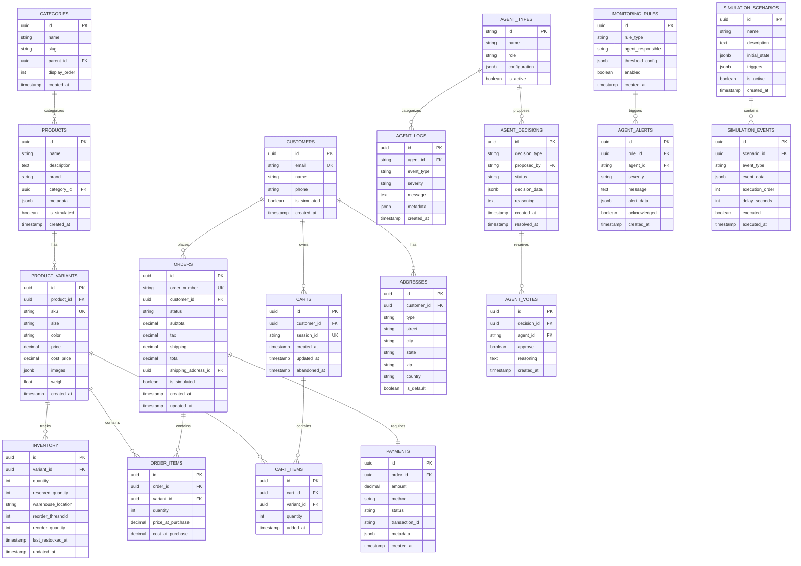

# Data Model & Database Schema

**Document Version:** 1.0  
**Last Updated:** February 12, 2026  
**Project:** OmniAgent Clothing Store

---

## Overview

This document defines the complete database schema for the OmniAgent Clothing Store system. The database serves as both an operational data store and a **simulation environment** where the business owner can seed and manipulate data to observe agent behaviors and test decision-making workflows.

---

## Database Technology

**Primary Database:** PostgreSQL 16.x

**Rationale:**
- ACID compliance for transactional integrity
- Rich JSON support for agent metadata
- Excellent performance with proper indexing
- Mature ecosystem with Prisma ORM
- Easy data seeding and manipulation

---

## Entity Relationship Diagram



---

## Schema Definitions (Prisma)

### Core E-commerce Schema

```prisma
// schema.prisma

datasource db {
  provider = "postgresql"
  url      = env("DATABASE_URL")
}

generator client {
  provider = "prisma-client-js"
}

// ============================================
// PRODUCT DOMAIN
// ============================================

model Category {
  id           String    @id @default(uuid())
  name         String
  slug         String    @unique
  parentId     String?   @map("parent_id")
  parent       Category? @relation("CategoryHierarchy", fields: [parentId], references: [id])
  children     Category[] @relation("CategoryHierarchy")
  displayOrder Int       @default(0) @map("display_order")
  products     Product[]
  createdAt    DateTime  @default(now()) @map("created_at")

  @@map("categories")
}

model Product {
  id          String           @id @default(uuid())
  name        String
  description String?          @db.Text
  brand       String?
  categoryId  String           @map("category_id")
  category    Category         @relation(fields: [categoryId], references: [id])
  variants    ProductVariant[]
  metadata    Json?            // Additional product attributes
  isSimulated Boolean          @default(false) @map("is_simulated")
  createdAt   DateTime         @default(now()) @map("created_at")

  @@index([categoryId])
  @@map("products")
}

model ProductVariant {
  id         String      @id @default(uuid())
  productId  String      @map("product_id")
  product    Product     @relation(fields: [productId], references: [id], onDelete: Cascade)
  sku        String      @unique
  size       String?
  color      String?
  price      Decimal     @db.Decimal(10, 2)
  costPrice  Decimal     @map("cost_price") @db.Decimal(10, 2)
  images     Json?       // Array of image URLs
  weight     Float?      // Weight in kg
  inventory  Inventory?
  orderItems OrderItem[]
  cartItems  CartItem[]
  createdAt  DateTime    @default(now()) @map("created_at")

  @@index([productId])
  @@index([sku])
  @@map("product_variants")
}

model Inventory {
  id                String         @id @default(uuid())
  variantId         String         @unique @map("variant_id")
  variant           ProductVariant @relation(fields: [variantId], references: [id], onDelete: Cascade)
  quantity          Int            @default(0)
  reservedQuantity  Int            @default(0) @map("reserved_quantity")
  warehouseLocation String?        @map("warehouse_location")
  reorderThreshold  Int            @default(10) @map("reorder_threshold")
  reorderQuantity   Int            @default(50) @map("reorder_quantity")
  lastRestockedAt   DateTime?      @map("last_restocked_at")
  updatedAt         DateTime       @updatedAt @map("updated_at")

  @@index([quantity])
  @@map("inventory")
}

// ============================================
// CUSTOMER & ORDER DOMAIN
// ============================================

model Customer {
  id          String    @id @default(uuid())
  email       String    @unique
  name        String
  phone       String?
  addresses   Address[]
  orders      Order[]
  carts       Cart[]
  isSimulated Boolean   @default(false) @map("is_simulated")
  createdAt   DateTime  @default(now()) @map("created_at")

  @@index([email])
  @@map("customers")
}

model Address {
  id         String   @id @default(uuid())
  customerId String   @map("customer_id")
  customer   Customer @relation(fields: [customerId], references: [id], onDelete: Cascade)
  type       String   // "billing" or "shipping"
  street     String
  city       String
  state      String
  zip        String
  country    String   @default("US")
  isDefault  Boolean  @default(false) @map("is_default")
  orders     Order[]

  @@index([customerId])
  @@map("addresses")
}

model Cart {
  id          String     @id @default(uuid())
  customerId  String?    @map("customer_id")
  customer    Customer?  @relation(fields: [customerId], references: [id], onDelete: Cascade)
  sessionId   String?    @unique @map("session_id") // For guest carts
  items       CartItem[]
  createdAt   DateTime   @default(now()) @map("created_at")
  updatedAt   DateTime   @updatedAt @map("updated_at")
  abandonedAt DateTime?  @map("abandoned_at") // Set when cart is abandoned

  @@index([customerId])
  @@index([sessionId])
  @@index([abandonedAt])
  @@map("carts")
}

model CartItem {
  id        String         @id @default(uuid())
  cartId    String         @map("cart_id")
  cart      Cart           @relation(fields: [cartId], references: [id], onDelete: Cascade)
  variantId String         @map("variant_id")
  variant   ProductVariant @relation(fields: [variantId], references: [id])
  quantity  Int            @default(1)
  addedAt   DateTime       @default(now()) @map("added_at")

  @@unique([cartId, variantId])
  @@index([cartId])
  @@map("cart_items")
}

model Order {
  id                String      @id @default(uuid())
  orderNumber       String      @unique @map("order_number")
  customerId        String      @map("customer_id")
  customer          Customer    @relation(fields: [customerId], references: [id])
  status            String      @default("pending") // pending, processing, shipped, delivered, cancelled
  subtotal          Decimal     @db.Decimal(10, 2)
  tax               Decimal     @default(0) @db.Decimal(10, 2)
  shipping          Decimal     @default(0) @db.Decimal(10, 2)
  total             Decimal     @db.Decimal(10, 2)
  shippingAddressId String      @map("shipping_address_id")
  shippingAddress   Address     @relation(fields: [shippingAddressId], references: [id])
  items             OrderItem[]
  payment           Payment?
  isSimulated       Boolean     @default(false) @map("is_simulated")
  createdAt         DateTime    @default(now()) @map("created_at")
  updatedAt         DateTime    @updatedAt @map("updated_at")

  @@index([customerId])
  @@index([status])
  @@index([createdAt])
  @@map("orders")
}

model OrderItem {
  id               String         @id @default(uuid())
  orderId          String         @map("order_id")
  order            Order          @relation(fields: [orderId], references: [id], onDelete: Cascade)
  variantId        String         @map("variant_id")
  variant          ProductVariant @relation(fields: [variantId], references: [id])
  quantity         Int
  priceAtPurchase  Decimal        @map("price_at_purchase") @db.Decimal(10, 2)
  costAtPurchase   Decimal        @map("cost_at_purchase") @db.Decimal(10, 2)

  @@index([orderId])
  @@map("order_items")
}

model Payment {
  id            String   @id @default(uuid())
  orderId       String   @unique @map("order_id")
  order         Order    @relation(fields: [orderId], references: [id], onDelete: Cascade)
  amount        Decimal  @db.Decimal(10, 2)
  method        String   // "credit_card", "paypal", "bank_transfer"
  status        String   @default("pending") // pending, completed, failed, refunded
  transactionId String?  @map("transaction_id")
  metadata      Json?    // Payment gateway specific data
  createdAt     DateTime @default(now()) @map("created_at")

  @@index([status])
  @@map("payments")
}

// ============================================
// AGENT SYSTEM DOMAIN
// ============================================

model AgentType {
  id            String          @id // "warden", "finance", "architect", "support", "executive"
  name          String
  role          String
  configuration Json?
  isActive      Boolean         @default(true) @map("is_active")
  logs          AgentLog[]
  decisions     AgentDecision[]
  votes         AgentVote[]
  alerts        AgentAlert[]

  @@map("agent_types")
}

model AgentLog {
  id        String    @id @default(uuid())
  agentId   String    @map("agent_id")
  agent     AgentType @relation(fields: [agentId], references: [id])
  eventType String    @map("event_type") // "query", "alert", "decision", "action", "error"
  severity  String    @default("info") // "info", "warning", "error", "critical"
  message   String    @db.Text
  metadata  Json?     // Additional context
  createdAt DateTime  @default(now()) @map("created_at")

  @@index([agentId, createdAt])
  @@index([eventType])
  @@index([severity])
  @@map("agent_logs")
}

model AgentDecision {
  id           String      @id @default(uuid())
  decisionType String      @map("decision_type") // "restock", "discount", "alert", "support_response"
  proposedBy   String      @map("proposed_by")
  proposer     AgentType   @relation(fields: [proposedBy], references: [id])
  status       String      @default("pending") // pending, approved, rejected, expired
  decisionData Json        @map("decision_data")
  reasoning    String?     @db.Text
  votes        AgentVote[]
  createdAt    DateTime    @default(now()) @map("created_at")
  resolvedAt   DateTime?   @map("resolved_at")

  @@index([status])
  @@index([createdAt])
  @@map("agent_decisions")
}

model AgentVote {
  id         String        @id @default(uuid())
  decisionId String        @map("decision_id")
  decision   AgentDecision @relation(fields: [decisionId], references: [id], onDelete: Cascade)
  agentId    String        @map("agent_id")
  agent      AgentType     @relation(fields: [agentId], references: [id])
  approve    Boolean
  reasoning  String?       @db.Text
  createdAt  DateTime      @default(now()) @map("created_at")

  @@unique([decisionId, agentId])
  @@map("agent_votes")
}

model MonitoringRule {
  id              String       @id @default(uuid())
  ruleType        String       @map("rule_type") // "inventory_threshold", "sales_velocity", "abandoned_cart"
  agentResponsible String      @map("agent_responsible")
  thresholdConfig Json         @map("threshold_config")
  enabled         Boolean      @default(true)
  alerts          AgentAlert[]
  createdAt       DateTime     @default(now()) @map("created_at")

  @@index([ruleType])
  @@map("monitoring_rules")
}

model AgentAlert {
  id            String         @id @default(uuid())
  ruleId        String         @map("rule_id")
  rule          MonitoringRule @relation(fields: [ruleId], references: [id])
  agentId       String         @map("agent_id")
  agent         AgentType      @relation(fields: [agentId], references: [id])
  severity      String         // "low", "medium", "high", "critical"
  message       String         @db.Text
  alertData     Json           @map("alert_data")
  acknowledged  Boolean        @default(false)
  createdAt     DateTime       @default(now()) @map("created_at")

  @@index([agentId, createdAt])
  @@index([severity])
  @@map("agent_alerts")
}

// ============================================
// SIMULATION DOMAIN
// ============================================

model SimulationScenario {
  id           String            @id @default(uuid())
  name         String
  description  String?           @db.Text
  initialState Json              @map("initial_state") // Starting conditions
  triggers     Json              // What events to simulate
  events       SimulationEvent[]
  isActive     Boolean           @default(false) @map("is_active")
  createdAt    DateTime          @default(now()) @map("created_at")

  @@map("simulation_scenarios")
}

model SimulationEvent {
  id             String              @id @default(uuid())
  scenarioId     String              @map("scenario_id")
  scenario       SimulationScenario  @relation(fields: [scenarioId], references: [id], onDelete: Cascade)
  eventType      String              @map("event_type") // "order", "stockout", "price_change", "trend_spike"
  eventData      Json                @map("event_data")
  executionOrder Int                 @map("execution_order")
  delaySeconds   Int                 @default(0) @map("delay_seconds")
  executed       Boolean             @default(false)
  executedAt     DateTime?           @map("executed_at")

  @@index([scenarioId, executionOrder])
  @@map("simulation_events")
}
```

---

## Data Seeding & Simulation Features

### 1. Initial Data Seed

The system includes comprehensive seed data for demonstration:

```typescript
// prisma/seed.ts
import { PrismaClient } from '@prisma/client';

const prisma = new PrismaClient();

async function main() {
  console.log('🌱 Seeding database...');
  
  // Seed categories
  const categories = await seedCategories();
  
  // Seed products (100 clothing items)
  const products = await seedProducts(categories);
  
  // Seed customers (50 simulated customers)
  const customers = await seedCustomers();
  
  // Seed historical orders (500 orders over 30 days)
  await seedOrders(customers, products);
  
  // Seed agent types
  await seedAgentTypes();
  
  // Seed monitoring rules
  await seedMonitoringRules();
  
  // Seed simulation scenarios
  await seedSimulationScenarios();
  
  console.log('✅ Database seeded successfully!');
}

async function seedProducts(categories: Category[]) {
  const products = [
    // T-Shirts
    {
      name: 'Classic Cotton Tee',
      description: 'Comfortable everyday t-shirt',
      brand: 'BasicWear',
      categoryId: categories.find(c => c.slug === 'tshirts')?.id,
      variants: [
        { size: 'S', color: 'Black', price: 19.99, costPrice: 8.00, quantity: 50 },
        { size: 'M', color: 'Black', price: 19.99, costPrice: 8.00, quantity: 100 },
        { size: 'L', color: 'Black', price: 19.99, costPrice: 8.00, quantity: 75 },
        { size: 'M', color: 'White', price: 19.99, costPrice: 8.00, quantity: 15 }, // Low stock
        { size: 'L', color: 'White', price: 19.99, costPrice: 8.00, quantity: 5 }, // Very low
      ]
    },
    // ... more products
  ];
  
  for (const product of products) {
    await prisma.product.create({
      data: {
        ...product,
        isSimulated: true,
        variants: {
          create: product.variants.map(v => ({
            sku: `${product.name.slice(0,3).toUpperCase()}-${v.size}-${v.color}`,
            size: v.size,
            color: v.color,
            price: v.price,
            costPrice: v.costPrice,
            inventory: {
              create: {
                quantity: v.quantity,
                reorderThreshold: 20,
                reorderQuantity: 100
              }
            }
          }))
        }
      }
    });
  }
}
```

### 2. Simulation Control API

Users can manipulate data to trigger agent responses:

```typescript
// src/controllers/simulation.controller.ts
export class SimulationController {
  // Trigger a stockout scenario
  async triggerStockout(req: Request, res: Response) {
    const { variantId } = req.body;
    
    await prisma.inventory.update({
      where: { variantId },
      data: { quantity: 0 }
    });
    
    // Warden agent will detect this on next check
    res.json({ message: 'Stockout triggered' });
  }
  
  // Simulate a sales spike
  async simulateSalesSpike(req: Request, res: Response) {
    const { variantId, orderCount } = req.body;
    
    // Create multiple orders quickly
    for (let i = 0; i < orderCount; i++) {
      await createSimulatedOrder(variantId);
    }
    
    // Warden will detect 3x sales velocity
    res.json({ message: `${orderCount} orders created` });
  }
  
  // Create abandoned carts
  async createAbandonedCart(req: Request, res: Response) {
    const { variantIds, cartValue } = req.body;
    
    const cart = await prisma.cart.create({
      data: {
        sessionId: `sim-${Date.now()}`,
        abandonedAt: new Date(Date.now() - 2 * 60 * 60 * 1000), // 2 hours ago
        items: {
          create: variantIds.map(id => ({
            variantId: id,
            quantity: 1
          }))
        }
      }
    });
    
    res.json({ cart });
  }
  
  // Adjust inventory levels
  async adjustInventory(req: Request, res: Response) {
    const { variantId, quantity } = req.body;
    
    await prisma.inventory.update({
      where: { variantId },
      data: { quantity }
    });
    
    res.json({ message: 'Inventory adjusted' });
  }
  
  // Run a simulation scenario
  async runScenario(req: Request, res: Response) {
    const { scenarioId } = req.params;
    
    const scenario = await prisma.simulationScenario.findUnique({
      where: { id: scenarioId },
      include: { events: true }
    });
    
    if (!scenario) {
      return res.status(404).json({ error: 'Scenario not found' });
    }
    
    // Execute events in order
    for (const event of scenario.events.sort((a, b) => a.executionOrder - b.executionOrder)) {
      await this.executeSimulationEvent(event);
      await new Promise(resolve => setTimeout(resolve, event.delaySeconds * 1000));
    }
    
    res.json({ message: 'Scenario executed' });
  }
  
  private async executeSimulationEvent(event: SimulationEvent) {
    switch (event.eventType) {
      case 'create_orders':
        // Create N orders
        break;
      case 'deplete_inventory':
        // Reduce inventory to threshold
        break;
      case 'abandon_cart':
        // Create abandoned carts
        break;
      case 'price_spike':
        // Temporarily increase prices
        break;
    }
  }
}
```

### 3. Predefined Simulation Scenarios

```typescript
// Scenario 1: Inventory Crisis
const inventoryCrisisScenario = {
  name: 'Inventory Crisis',
  description: 'Simulates multiple products hitting low stock simultaneously',
  initialState: {
    message: 'Normal operations with healthy inventory'
  },
  triggers: {
    variants: ['var-1', 'var-2', 'var-3'],
    targetQuantity: 5,
    expectedAgents: ['warden', 'finance', 'executive']
  },
  events: [
    {
      eventType: 'deplete_inventory',
      eventData: { variantIds: ['var-1', 'var-2', 'var-3'], quantity: 5 },
      executionOrder: 1,
      delaySeconds: 0
    },
    {
      eventType: 'trigger_check',
      eventData: { agentId: 'warden', action: 'inventory_check' },
      executionOrder: 2,
      delaySeconds: 5
    }
  ]
};

// Scenario 2: Trending Product
const trendingProductScenario = {
  name: 'Viral Product Trend',
  description: 'Simulates a product going viral with 10x sales spike',
  events: [
    {
      eventType: 'create_orders',
      eventData: { variantId: 'var-trending', count: 50 },
      executionOrder: 1,
      delaySeconds: 0
    },
    {
      eventType: 'social_mention',
      eventData: { product: 'Hoodie X', mentions: 1000 },
      executionOrder: 2,
      delaySeconds: 10
    }
  ]
};

// Scenario 3: Cash Flow Constraint
const cashFlowScenario = {
  name: 'Tight Cash Flow',
  description: 'Tests Finance Agent veto power when budget is constrained',
  initialState: {
    availableCash: 5000,
    pendingExpenses: 3000
  },
  events: [
    {
      eventType: 'deplete_inventory',
      eventData: { variantId: 'expensive-item', quantity: 2 },
      executionOrder: 1,
      delaySeconds: 0
    },
    {
      eventType: 'propose_restock',
      eventData: { cost: 5000, expectedVote: 'reject' },
      executionOrder: 2,
      delaySeconds: 5
    }
  ]
};
```

### 4. User Control Panel

The system includes a control panel for manual data manipulation:

**Available Controls:**
- **Inventory Slider**: Adjust stock levels for any variant (0-500)
- **Order Generator**: Create N orders for specific products
- **Cart Abandoner**: Generate abandoned carts with configurable value
- **Time Machine**: Backdate orders to simulate historical trends
- **Price Adjuster**: Temporarily modify product prices
- **Sales Multiplier**: Apply velocity multiplier to simulate trends
- **Cash Flow Editor**: Set available budget for Finance Agent tests

---

## Database Indexes

### Performance-Critical Indexes

```sql
-- Product search and filtering
CREATE INDEX idx_products_category ON products(category_id);
CREATE INDEX idx_products_name ON products(name);
CREATE INDEX idx_product_variants_sku ON product_variants(sku);

-- Inventory monitoring
CREATE INDEX idx_inventory_quantity ON inventory(quantity);
CREATE INDEX idx_inventory_variant ON inventory(variant_id);

-- Order processing
CREATE INDEX idx_orders_customer ON orders(customer_id);
CREATE INDEX idx_orders_status ON orders(status);
CREATE INDEX idx_orders_created ON orders(created_at DESC);
CREATE INDEX idx_order_items_variant ON order_items(variant_id);

-- Cart abandonment detection
CREATE INDEX idx_carts_abandoned ON carts(abandoned_at) WHERE abandoned_at IS NOT NULL;
CREATE INDEX idx_carts_session ON carts(session_id);

-- Agent system
CREATE INDEX idx_agent_logs_timestamp ON agent_logs(agent_id, created_at DESC);
CREATE INDEX idx_agent_decisions_status ON agent_decisions(status, created_at DESC);
CREATE INDEX idx_agent_alerts_severity ON agent_alerts(severity, created_at DESC);

-- Composite indexes for complex queries
CREATE INDEX idx_variants_product_price ON product_variants(product_id, price);
CREATE INDEX idx_inventory_low_stock ON inventory(quantity) WHERE quantity < 20;
```

---

## Sample Queries

### Agent Monitoring Queries

```sql
-- Warden: Find low stock items
SELECT 
  pv.sku,
  p.name,
  pv.size,
  pv.color,
  i.quantity,
  i.reorder_threshold,
  AVG(oi.quantity) as avg_daily_sales
FROM product_variants pv
JOIN products p ON pv.product_id = p.id
JOIN inventory i ON i.variant_id = pv.id
LEFT JOIN order_items oi ON oi.variant_id = pv.id
LEFT JOIN orders o ON oi.order_id = o.id AND o.created_at > NOW() - INTERVAL '7 days'
WHERE i.quantity < i.reorder_threshold
GROUP BY pv.id, p.name, i.quantity, i.reorder_threshold
ORDER BY i.quantity ASC;

-- Warden: Detect trending products (3x baseline)
WITH sales_baseline AS (
  SELECT 
    variant_id,
    AVG(daily_sales) as baseline_daily_sales
  FROM (
    SELECT 
      variant_id,
      DATE(o.created_at) as sale_date,
      SUM(oi.quantity) as daily_sales
    FROM order_items oi
    JOIN orders o ON oi.order_id = o.id
    WHERE o.created_at > NOW() - INTERVAL '14 days'
      AND o.created_at < NOW() - INTERVAL '1 day'
    GROUP BY variant_id, DATE(o.created_at)
  ) daily
  GROUP BY variant_id
)
SELECT 
  pv.sku,
  p.name,
  pv.size,
  pv.color,
  sb.baseline_daily_sales,
  SUM(oi.quantity) as today_sales,
  SUM(oi.quantity) / NULLIF(sb.baseline_daily_sales, 0) as velocity_multiplier
FROM order_items oi
JOIN orders o ON oi.order_id = o.id
JOIN product_variants pv ON oi.variant_id = pv.id
JOIN products p ON pv.product_id = p.id
LEFT JOIN sales_baseline sb ON oi.variant_id = sb.variant_id
WHERE o.created_at > NOW() - INTERVAL '24 hours'
GROUP BY pv.id, p.name, sb.baseline_daily_sales
HAVING SUM(oi.quantity) > sb.baseline_daily_sales * 3;

-- Warden: Find abandoned high-value carts
SELECT 
  c.id,
  c.session_id,
  c.abandoned_at,
  cu.email,
  cu.name,
  SUM(pv.price * ci.quantity) as cart_value,
  COUNT(ci.id) as item_count
FROM carts c
JOIN cart_items ci ON c.id = ci.cart_id
JOIN product_variants pv ON ci.variant_id = pv.id
LEFT JOIN customers cu ON c.customer_id = cu.id
WHERE c.abandoned_at IS NOT NULL
  AND c.abandoned_at > NOW() - INTERVAL '24 hours'
  AND c.abandoned_at < NOW() - INTERVAL '1 hour'
GROUP BY c.id, cu.email, cu.name
HAVING SUM(pv.price * ci.quantity) > 50
ORDER BY cart_value DESC;

-- Finance: Calculate cash position
SELECT 
  SUM(CASE WHEN o.created_at > NOW() - INTERVAL '30 days' THEN o.total ELSE 0 END) as revenue_30d,
  SUM(CASE WHEN o.created_at > NOW() - INTERVAL '30 days' 
      THEN (oi.cost_at_purchase * oi.quantity) ELSE 0 END) as cogs_30d,
  SUM(CASE WHEN o.created_at > NOW() - INTERVAL '30 days' 
      THEN o.total - (oi.cost_at_purchase * oi.quantity) ELSE 0 END) as profit_30d
FROM orders o
JOIN order_items oi ON o.order_id = oi.id
WHERE o.status != 'cancelled';

-- Architect: Product performance report
SELECT 
  p.name,
  p.brand,
  c.name as category,
  COUNT(DISTINCT oi.order_id) as order_count,
  SUM(oi.quantity) as units_sold,
  SUM(oi.price_at_purchase * oi.quantity) as revenue,
  SUM((oi.price_at_purchase - oi.cost_at_purchase) * oi.quantity) as profit,
  AVG(oi.price_at_purchase) as avg_price
FROM products p
JOIN product_variants pv ON p.id = pv.product_id
JOIN order_items oi ON pv.id = oi.variant_id
JOIN orders o ON oi.order_id = o.id
JOIN categories c ON p.category_id = c.id
WHERE o.created_at > NOW() - INTERVAL '30 days'
GROUP BY p.id, c.name
ORDER BY revenue DESC
LIMIT 20;
```

---

## Data Retention & Cleanup

### Simulation Data Management

```sql
-- Clean up old simulated data (keep last 90 days)
DELETE FROM orders 
WHERE is_simulated = true 
  AND created_at < NOW() - INTERVAL '90 days';

-- Reset simulation to initial state
TRUNCATE TABLE agent_logs CASCADE;
TRUNCATE TABLE agent_decisions CASCADE;
TRUNCATE TABLE agent_alerts CASCADE;
UPDATE simulation_events SET executed = false, executed_at = NULL;
```

---

## Document Cross-References

- **System Overview**: [`01-system-overview.md`](./01-system-overview.md)
- **Technical Design**: [`03-technical-design.md`](./03-technical-design.md)
- **API Specifications**: [`05-api-specification.md`](./05-api-specification.md)
- **Agent Architecture**: [`06-agent-architecture.md`](./06-agent-architecture.md)

---

## Version History

| Version | Date | Author | Changes |
|---------|------|--------|---------|
| 1.0 | 2026-02-12 | System | Initial data model with simulation features |

---

*This schema supports both operational e-commerce and simulation/testing workflows to demonstrate agent capabilities.*
