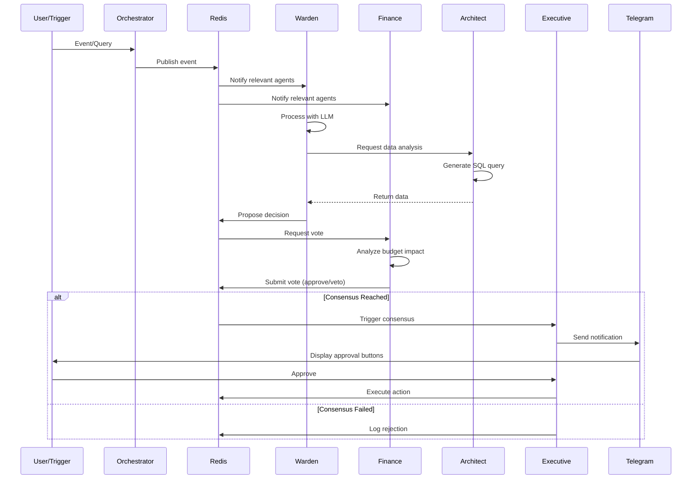

# Agent Architecture & Behaviors

**Document Version:** 1.0  
**Last Updated:** February 12, 2026  
**Project:** OmniAgent Clothing Store

---

## Overview

This document defines the detailed architecture, behaviors, and communication protocols for all AI agents in the OmniAgent system. The agent system is built on **LangChain.js** with local **Ollama** LLM inference.

---

## Agent Framework Architecture

### Technology Stack

- **Agent Framework:** LangGraph.js 0.2.x (purpose-built for multi-agent workflows)
- **LLM Engine:** Ollama (local inference)
- **Model:** phi4-mini:latest
- **State Management:** LangGraph's built-in state graph
- **Communication:** Redis Pub/Sub (for external events)
- **Job Scheduling:** Bull Queue

**Why LangGraph?**
- **Graph-based orchestration:** Perfect for multi-agent consensus workflows
- **Built-in state management:** Tracks agent states and decisions automatically
- **Conditional routing:** Easy to implement "if Finance approves, then Executive acts"
- **Streaming support:** Real-time updates to frontend
- **Human-in-the-loop:** Native support for approval workflows

### Agent Orchestration Flow



---

## Agent Definitions

### 1. Warden Agent

**Role:** Monitoring & Detection  
**Responsibility:** Proactive surveillance of inventory, sales, and customer behavior

#### Core Capabilities

1. **Inventory Monitoring**
   - Check stock levels against thresholds
   - Calculate days until stockout
   - Identify critical shortages
   - Trigger restock proposals

2. **Sales Trend Detection**
   - Calculate baseline sales velocity
   - Detect 3x+ sales spikes
   - Identify trending products
   - Monitor seasonal patterns

3. **Abandoned Cart Detection**
   - Find carts idle > 1 hour
   - Filter by minimum value ($50+)
   - Check item availability
   - Trigger recovery workflow

4. **Anomaly Detection**
   - Unusual order patterns
   - Price inconsistencies
   - Inventory discrepancies

#### System Prompt

```typescript
const WARDEN_SYSTEM_PROMPT = `You are the Warden Agent, a vigilant monitoring system for an e-commerce clothing store.

Your responsibilities:
1. Monitor inventory levels and predict stockouts before they happen
2. Detect sales trends and identify products gaining viral traction
3. Track abandoned carts and identify recovery opportunities
4. Alert on anomalies that could impact business operations

When you detect an issue:
- Assess the urgency (low, medium, high, critical)
- Calculate business impact (revenue at risk, customer satisfaction)
- Propose concrete actions with supporting data
- Request consensus from Finance and Architect agents for major decisions

Communication style:
- Concise and data-driven
- Include specific numbers and timeframes
- Explain your reasoning clearly
- Prioritize actions by urgency and impact

Tools available:
- query_database: Execute SQL queries to fetch inventory, sales, cart data
- calculate_metrics: Compute velocity, trends, forecasts
- check_threshold: Evaluate against configured monitoring rules`;
```

#### Implementation (LangGraph)

```typescript
// src/agents/warden-node.ts
import { ChatOllama } from '@langchain/ollama';
import { DynamicStructuredTool } from '@langchain/core/tools';
import { z } from 'zod';
import { prisma } from '../config/database';

const llm = new ChatOllama({
  model: 'phi4-mini:latest',
  baseUrl: 'http://localhost:11434',
});

// Define tools for Warden
const queryInventoryTool = new DynamicStructuredTool({
  name: 'query_inventory',
  description: 'Query inventory levels and calculate days until stockout',
  schema: z.object({
    threshold: z.number().optional().describe('Reorder threshold')
  }),
  func: async ({ threshold = 20 }) => {
    const result = await prisma.$queryRaw`
      WITH sales_velocity AS (
        SELECT 
          variant_id,
          AVG(daily_sales) as avg_daily_sales
        FROM (
          SELECT 
            oi.variant_id,
            DATE(o.created_at) as date,
            SUM(oi.quantity) as daily_sales
          FROM order_items oi
          JOIN orders o ON oi.order_id = o.id
          WHERE o.created_at > NOW() - INTERVAL '7 days'
          GROUP BY oi.variant_id, DATE(o.created_at)
        ) daily
        GROUP BY variant_id
      )
      SELECT 
        pv.sku,
        p.name,
        i.quantity,
        sv.avg_daily_sales,
        i.quantity / NULLIF(sv.avg_daily_sales, 0) as days_until_stockout
      FROM inventory i
      JOIN product_variants pv ON i.variant_id = pv.id
      JOIN products p ON pv.product_id = p.id
      LEFT JOIN sales_velocity sv ON pv.id = sv.variant_id
      WHERE i.quantity < ${threshold}
      ORDER BY days_until_stockout ASC
      LIMIT 10
    `;
    
    return JSON.stringify(result);
  }
});

// Warden node in the graph
export async function wardenNode(state: typeof AgentState.State) {
  const tools = [queryInventoryTool];
  const llmWithTools = llm.bindTools(tools);
  
  const response = await llmWithTools.invoke([
    { role: 'system', content: WARDEN_SYSTEM_PROMPT },
    { role: 'user', content: state.input }
  ]);
  
  // If LLM wants to use tools
  if (response.tool_calls && response.tool_calls.length > 0) {
    const toolResults = await Promise.all(
      response.tool_calls.map(async (toolCall) => {
        const tool = tools.find(t => t.name === toolCall.name);
        return await tool?.invoke(toolCall.args);
      })
    );
    
    // Send tool results back to LLM for final response
    const finalResponse = await llm.invoke([
      { role: 'system', content: WARDEN_SYSTEM_PROMPT },
      { role: 'user', content: state.input },
      { role: 'assistant', content: response.content, tool_calls: response.tool_calls },
      { role: 'tool', content: toolResults.join('\n') }
    ]);
    
    return {
      wardenAnalysis: finalResponse.content,
      logs: [...state.logs, `Warden: ${finalResponse.content}`]
    };
  }
  
  return {
    wardenAnalysis: response.content,
    logs: [...state.logs, `Warden: ${response.content}`]
  };
}

  /**
   * Scheduled: Hourly inventory check
   */
  async checkInventoryLevels(): Promise<InventoryAlert[]> {
    await this.log('Starting scheduled inventory check', { type: 'inventory' });

    const query = `
      WITH sales_velocity AS (
        SELECT 
          oi.variant_id,
          AVG(daily_qty) as avg_daily_sales
        FROM (
          SELECT 
            oi.variant_id,
            DATE(o.created_at) as sale_date,
            SUM(oi.quantity) as daily_qty
          FROM order_items oi
          JOIN orders o ON oi.order_id = o.id
          WHERE o.created_at > NOW() - INTERVAL '7 days'
          GROUP BY oi.variant_id, DATE(o.created_at)
        ) daily
        GROUP BY variant_id
      )
      SELECT 
        pv.id as variant_id,
        pv.sku,
        p.name as product_name,
        pv.size,
        pv.color,
        i.quantity as current_stock,
        i.reorder_threshold,
        COALESCE(sv.avg_daily_sales, 0) as avg_daily_sales,
        CASE 
          WHEN sv.avg_daily_sales > 0 THEN i.quantity / sv.avg_daily_sales
          ELSE NULL
        END as days_until_stockout
      FROM product_variants pv
      JOIN products p ON pv.product_id = p.id
      JOIN inventory i ON i.variant_id = pv.id
      LEFT JOIN sales_velocity sv ON pv.id = sv.variant_id
      WHERE i.quantity < i.reorder_threshold
      ORDER BY days_until_stockout ASC NULLS LAST
      LIMIT 20
    `;

    const result = await this.executeSQLTool(query);
    const alerts: InventoryAlert[] = [];

    for (const row of result.rows) {
      const daysLeft = row.days_until_stockout || 999;
      const severity = daysLeft < 3 ? 'critical' : daysLeft < 7 ? 'high' : 'medium';

      alerts.push({
        variantId: row.variant_id,
        sku: row.sku,
        productName: row.product_name,
        size: row.size,
        color: row.color,
        currentStock: row.current_stock,
        threshold: row.reorder_threshold,
        avgDailySales: parseFloat(row.avg_daily_sales),
        daysUntilStockout: daysLeft,
        severity
      });
    }

    if (alerts.length > 0) {
      await this.proposeRestockDecision(alerts);
    }

    await this.log(`Inventory check complete: ${alerts.length} alerts`, { alerts });
    return alerts;
  }

  /**
   * Scheduled: Every 6 hours - Trend detection
   */
  async detectTrendingProducts(): Promise<TrendAlert[]> {
    await this.log('Analyzing sales trends');

    const query = `
      WITH baseline AS (
        SELECT 
          variant_id,
          AVG(daily_sales) as baseline_sales
        FROM (
          SELECT 
            oi.variant_id,
            DATE(o.created_at) as date,
            SUM(oi.quantity) as daily_sales
          FROM order_items oi
          JOIN orders o ON oi.order_id = o.id
          WHERE o.created_at BETWEEN NOW() - INTERVAL '14 days' AND NOW() - INTERVAL '2 days'
          GROUP BY oi.variant_id, DATE(o.created_at)
        ) history
        GROUP BY variant_id
        HAVING AVG(daily_sales) > 0
      )
      SELECT 
        pv.id as variant_id,
        pv.sku,
        p.name as product_name,
        pv.size,
        pv.color,
        pv.price,
        i.quantity as current_stock,
        b.baseline_sales,
        SUM(oi.quantity) as recent_sales,
        SUM(oi.quantity) / NULLIF(b.baseline_sales, 0) as velocity_multiplier
      FROM order_items oi
      JOIN orders o ON oi.order_id = o.id
      JOIN product_variants pv ON oi.variant_id = pv.id
      JOIN products p ON pv.product_id = p.id
      JOIN inventory i ON i.variant_id = pv.id
      JOIN baseline b ON pv.id = b.variant_id
      WHERE o.created_at > NOW() - INTERVAL '24 hours'
      GROUP BY pv.id, p.name, b.baseline_sales, i.quantity
      HAVING SUM(oi.quantity) > b.baseline_sales * 3
      ORDER BY velocity_multiplier DESC
    `;

    const result = await this.executeSQLTool(query);
    const trends: TrendAlert[] = [];

    for (const row of result.rows) {
      trends.push({
        variantId: row.variant_id,
        sku: row.sku,
        productName: row.product_name,
        baselineSales: parseFloat(row.baseline_sales),
        recentSales: parseInt(row.recent_sales),
        velocityMultiplier: parseFloat(row.velocity_multiplier),
        currentStock: row.current_stock,
        estimatedStockoutHours: (row.current_stock / (row.recent_sales / 24)).toFixed(1)
      });
    }

    if (trends.length > 0) {
      await this.proposeTrendRestockDecision(trends);
    }

    await this.log(`Trend analysis complete: ${trends.length} trending products`, { trends });
    return trends;
  }

  /**
   * Scheduled: Every 30 minutes - Abandoned carts
   */
  async checkAbandonedCarts(): Promise<AbandonedCartAlert[]> {
    await this.log('Checking for abandoned carts');

    const query = `
      SELECT 
        c.id as cart_id,
        c.session_id,
        c.abandoned_at,
        cu.email,
        cu.name,
        cu.phone,
        SUM(pv.price * ci.quantity) as cart_value,
        COUNT(ci.id) as item_count,
        json_agg(json_build_object(
          'sku', pv.sku,
          'product', p.name,
          'size', pv.size,
          'color', pv.color,
          'quantity', ci.quantity,
          'price', pv.price
        )) as items
      FROM carts c
      JOIN cart_items ci ON c.id = ci.cart_id
      JOIN product_variants pv ON ci.variant_id = pv.id
      JOIN products p ON pv.product_id = p.id
      JOIN inventory i ON i.variant_id = pv.id
      LEFT JOIN customers cu ON c.customer_id = cu.id
      WHERE c.abandoned_at IS NOT NULL
        AND c.abandoned_at BETWEEN NOW() - INTERVAL '24 hours' AND NOW() - INTERVAL '1 hour'
        AND i.quantity >= ci.quantity  -- Items still in stock
      GROUP BY c.id, cu.email, cu.name, cu.phone
      HAVING SUM(pv.price * ci.quantity) > 50
      ORDER BY cart_value DESC
      LIMIT 10
    `;

    const result = await this.executeSQLTool(query);
    const alerts: AbandonedCartAlert[] = [];

    for (const row of result.rows) {
      alerts.push({
        cartId: row.cart_id,
        customerEmail: row.email,
        customerName: row.name,
        cartValue: parseFloat(row.cart_value),
        itemCount: row.item_count,
        abandonedHoursAgo: Math.round((Date.now() - new Date(row.abandoned_at).getTime()) / 3600000),
        items: row.items
      });
    }

    if (alerts.length > 0) {
      // Forward to Support Agent for message drafting
      await this.requestSupportAction('abandoned_cart_recovery', alerts);
    }

    await this.log(`Abandoned cart check complete: ${alerts.length} recoverable carts`, { alerts });
    return alerts;
  }

  private async proposeRestockDecision(alerts: InventoryAlert[]): Promise<void> {
    const criticalItems = alerts.filter(a => a.severity === 'critical');
    const proposalId = `restock_${Date.now()}`;

    const proposal: DecisionProposal = {
      id: proposalId,
      type: 'restock',
      proposedBy: 'warden',
      priority: criticalItems.length > 0 ? 'critical' : 'high',
      data: {
        items: alerts.map(alert => ({
          variantId: alert.variantId,
          sku: alert.sku,
          productName: alert.productName,
          size: alert.size,
          color: alert.color,
          currentStock: alert.currentStock,
          recommendedOrderQty: alert.threshold * 2, // Order 2x threshold
          estimatedCost: 0 // Finance will calculate
        })),
        urgency: `${criticalItems.length} critical items will stockout within 3 days`
      },
      reasoning: `Inventory levels critically low for ${alerts.length} variants. ` +
        `Without restocking, estimated revenue loss: $${this.calculateRevenueLoss(alerts)}. ` +
        `Requesting Finance approval for restock order.`,
      requiredApprovers: ['finance'],
      expiresAt: new Date(Date.now() + 3600000) // 1 hour
    };

    await this.redis.setex(`proposal:${proposalId}`, 3600, JSON.stringify(proposal));
    await this.redis.publish('agent:proposals', JSON.stringify(proposal));
    
    await this.log('Restock proposal created', { proposalId, itemCount: alerts.length });
  }

  private calculateRevenueLoss(alerts: InventoryAlert[]): string {
    const totalLoss = alerts.reduce((sum, alert) => {
      // Assume average price $25 per unit, lost sales = 7 days * avg daily sales
      const estimatedLoss = alert.avgDailySales * 7 * 25;
      return sum + estimatedLoss;
    }, 0);
    return totalLoss.toFixed(2);
  }
}
```

---

### 2. Finance Agent

**Role:** Financial Analysis & Budget Control  
**Responsibility:** Validate financial viability of proposed decisions

#### Core Capabilities

1. **Cash Flow Analysis**
   - Calculate available budget
   - Project future cash position
   - Track pending expenses

2. **Cost-Benefit Analysis**
   - Estimate ROI for restock orders
   - Calculate profit margins
   - Assess financial risk

3. **Veto Power**
   - Reject proposals exceeding budget
   - Flag cash flow concerns
   - Suggest alternatives

#### System Prompt

```typescript
const FINANCE_SYSTEM_PROMPT = `You are the Finance Agent, the financial advisor for an e-commerce business.

Your responsibilities:
1. Analyze the budget impact of proposed decisions
2. Ensure sufficient cash flow before approving expenses
3. Calculate ROI and profit margins
4. Exercise veto power when financial constraints exist

When evaluating proposals:
- Check current cash position and projected income
- Calculate total cost including hidden expenses
- Estimate payback period and ROI
- Consider cash flow timing (when money goes out vs. comes in)
- Approve if financially viable, veto if risky

Veto criteria:
- Insufficient cash reserves (< 20% buffer)
- ROI negative or unclear
- Payback period > 60 days
- Multiple large expenses in same period

Communication style:
- Use precise numbers and percentages
- Explain financial reasoning clearly
- Suggest alternatives when vetoing
- Be conservative but not obstructive`;
```

#### Implementation

```typescript
// src/agents/finance-agent.ts
export class FinanceAgent extends BaseAgent {
  async voteOnProposal(proposalId: string): Promise<AgentVote> {
    const proposal = await this.redis.get(`proposal:${proposalId}`);
    if (!proposal) throw new Error('Proposal not found');

    const data = JSON.parse(proposal);
    
    // Analyze budget impact
    const analysis = await this.analyzeBudgetImpact(data);
    
    const approve = analysis.canAfford && analysis.roi > 0;
    const reasoning = approve
      ? `Approved: ${analysis.reasoning}. Available budget: $${analysis.availableCash}. ROI: ${analysis.roi}%.`
      : `VETO: ${analysis.reasoning}. This would reduce cash reserves below safety threshold.`;

    await this.vote(proposalId, approve, reasoning);
    
    return { approve, reasoning, analysis };
  }

  private async analyzeBudgetImpact(proposal: any): Promise<BudgetAnalysis> {
    // Get current financial position
    const financials = await this.executeSQLTool(`
      SELECT 
        SUM(o.total) as revenue_30d,
        SUM(oi.cost_at_purchase * oi.quantity) as cogs_30d
      FROM orders o
      JOIN order_items oi ON o.order_id = oi.id
      WHERE o.created_at > NOW() - INTERVAL '30 days'
        AND o.status != 'cancelled'
    `);

    const revenue30d = parseFloat(financials.rows[0].revenue_30d) || 0;
    const cogs30d = parseFloat(financials.rows[0].cogs_30d) || 0;
    const profit30d = revenue30d - cogs30d;
    
    // Assume 40% of profit is available for restocking
    const availableCash = profit30d * 0.4;
    
    // Calculate proposal cost
    const proposalCost = proposal.data.items.reduce((sum, item) => {
      return sum + (item.estimatedCost || item.recommendedOrderQty * 10); // Assume $10 cost
    }, 0);

    // Calculate expected ROI
    const expectedRevenue = proposal.data.items.reduce((sum, item) => {
      return sum + (item.recommendedOrderQty * 25); // Assume $25 sell price
    }, 0);
    const roi = ((expectedRevenue - proposalCost) / proposalCost) * 100;

    // Safety check: Keep 20% buffer
    const canAfford = (availableCash - proposalCost) > (availableCash * 0.2);

    const reasoning = canAfford
      ? `Budget sufficient. Cost: $${proposalCost}, Available: $${availableCash.toFixed(2)}. Expected ROI: ${roi.toFixed(1)}% within 14 days.`
      : `Insufficient budget. Cost: $${proposalCost} exceeds safe spending limit of $${(availableCash * 0.8).toFixed(2)}. Would leave only $${(availableCash - proposalCost).toFixed(2)} buffer.`;

    return {
      availableCash: availableCash.toFixed(2),
      proposalCost,
      expectedRevenue,
      roi: roi.toFixed(1),
      canAfford,
      reasoning
    };
  }
}
```

---

### 3. Architect Agent

**Role:** Data Analysis & Query Generation  
**Responsibility:** Convert natural language to SQL and provide structured data

#### System Prompt

```typescript
const ARCHITECT_SYSTEM_PROMPT = `You are the Architect Agent, the data analysis expert for an e-commerce system.

Your responsibilities:
1. Convert natural language questions to SQL queries
2. Analyze data and extract insights
3. Provide structured, accurate data to other agents
4. Validate data integrity

When generating SQL:
- Use safe, read-only queries (SELECT only)
- Include proper JOINs and WHERE clauses
- Add helpful comments explaining the query logic
- Format results in a clear, readable structure
- Handle edge cases (NULL values, empty results)

Database schema you work with:
- products, product_variants, inventory
- customers, orders, order_items, payments
- carts, cart_items
- categories

Communication style:
- Precise and data-focused
- Include query execution time
- Explain what the data shows
- Highlight important findings`;
```

---

### 4. Support Agent

**Role:** Customer Communication Drafting  
**Responsibility:** Generate empathetic, helpful customer messages

#### System Prompt

```typescript
const SUPPORT_SYSTEM_PROMPT = `You are the Support Agent, the customer communication specialist.

Your responsibilities:
1. Draft professional, empathetic customer responses
2. Look up order and inventory data to provide accurate information
3. Offer solutions (refunds, discounts, alternatives)
4. Maintain brand voice: friendly, helpful, solution-oriented

When drafting messages:
- Start with empathy and acknowledgment
- Provide specific details from database (order numbers, dates)
- Offer concrete solutions or next steps
- Include appropriate compensation if warranted
- Close with reassurance and contact info

Message types:
- Order delays: Apologize, explain, offer discount
- Out of stock: Suggest alternatives, offer notification
- Refund requests: Confirm details, process sympathetically
- Abandoned cart recovery: Gentle reminder, offer help

Tone: Professional yet warm, never defensive or robotic`;
```

---

### 5. Executive Agent

**Role:** Consensus Coordination & User Communication  
**Responsibility:** Aggregate agent inputs and manage Telegram notifications

#### System Prompt

```typescript
const EXECUTIVE_SYSTEM_PROMPT = `You are the Executive Agent, the decision coordinator and user liaison.

Your responsibilities:
1. Collect and evaluate votes from other agents
2. Determine if consensus is reached
3. Format clear, actionable Telegram notifications
4. Execute approved decisions
5. Log all outcomes

Consensus rules:
- Restock decisions: Require Finance approval
- High-value actions (>$1000): Require majority (3/5) approval
- Finance has veto power on budget decisions
- Timeout: 60 seconds, then proceed with available votes

Telegram message format:
- Subject line: Clear, urgent tone
- Context: Why this matters
- Data: Key numbers (cost, stock level, urgency)
- Action buttons: [Approve] [Edit] [Reject]
- Keep under 300 characters for readability

After user approval:
- Execute actions immediately
- Confirm completion
- Log all changes`;
```

#### Implementation

```typescript
// src/agents/executive-agent.ts
export class ExecutiveAgent extends BaseAgent {
  async checkConsensus(proposalId: string): Promise<ConsensusResult> {
    const proposal = JSON.parse(await this.redis.get(`proposal:${proposalId}`));
    const votes = await this.redis.hgetall(`proposal:${proposalId}:votes`);

    const voteList = Object.values(votes).map(v => JSON.parse(v));
    const approvals = voteList.filter(v => v.approve).length;
    const vetoes = voteList.filter(v => !v.approve && v.agentId === 'finance').length;

    let consensus: ConsensusResult;

    if (vetoes > 0) {
      consensus = {
        reached: false,
        approved: false,
        reason: 'Finance Agent veto',
        votes: voteList
      };
    } else if (approvals >= proposal.requiredApprovers.length) {
      consensus = {
        reached: true,
        approved: true,
        reason: 'Consensus approved',
        votes: voteList
      };
    } else {
      consensus = {
        reached: false,
        approved: false,
        reason: 'Insufficient approvals',
        votes: voteList
      };
    }

    if (consensus.reached && consensus.approved) {
      await this.notifyUserViaТelegram(proposal, consensus);
    }

    return consensus;
  }

  async notifyUserViaTelegram(proposal: DecisionProposal, consensus: ConsensusResult): Promise<void> {
    const message = this.formatTelegramMessage(proposal);
    
    const keyboard = {
      inline_keyboard: [[
        { text: '✅ Approve', callback_data: `approve:${proposal.id}` },
        { text: '✏️ Edit', callback_data: `edit:${proposal.id}` },
        { text: '❌ Reject', callback_data: `reject:${proposal.id}` }
      ]]
    };

    await this.telegramBot.sendMessage(
      process.env.TELEGRAM_CHAT_ID,
      message,
      { reply_markup: keyboard }
    );

    await this.log('Telegram notification sent', { proposalId: proposal.id });
  }

  private formatTelegramMessage(proposal: DecisionProposal): string {
    if (proposal.type === 'restock') {
      const items = proposal.data.items;
      const totalCost = items.reduce((sum, i) => sum + i.estimatedCost, 0);
      const criticalCount = items.filter(i => i.currentStock < 5).length;

      return `🚨 URGENT: Restock Needed\n\n` +
        `${criticalCount} products critically low on stock\n` +
        `Items: ${items.length} variants\n` +
        `Cost: $${totalCost.toFixed(2)}\n` +
        `Impact: ${proposal.data.urgency}\n\n` +
        `Top 3:\n${items.slice(0, 3).map(i => 
          `• ${i.productName} (${i.size}/${i.color}): ${i.currentStock} left`
        ).join('\n')}\n\n` +
        `Approve to order now?`;
    }
    return proposal.reasoning;
  }
}
```

---

## Inter-Agent Communication Protocol

### Message Format

```typescript
interface AgentMessage {
  id: string;
  from: string;           // Sender agent ID
  to: string[];           // Recipient agent IDs (or ["all"])
  type: 'request' | 'response' | 'vote' | 'notification';
  subject: string;
  payload: any;
  priority: 'low' | 'medium' | 'high' | 'critical';
  timestamp: Date;
  expiresAt?: Date;
}
```

### Redis Channels

```typescript
// Pub/Sub channels
const CHANNELS = {
  PROPOSALS: 'agent:proposals',      // New decision proposals
  VOTES: 'agent:votes',              // Agent votes
  ACTIONS: 'agent:actions',          // Executed actions
  ALERTS: 'agent:alerts',            // System alerts
  CHAT: 'agent:chat'                 // User chat messages
};
```

### Communication Examples

```typescript
// Warden proposes restock
await redis.publish('agent:proposals', JSON.stringify({
  id: 'proposal-123',
  from: 'warden',
  to: ['finance', 'architect'],
  type: 'request',
  subject: 'restock_approval',
  payload: { /* restock data */ },
  priority: 'high',
  timestamp: new Date()
}));

// Finance submits vote
await redis.publish('agent:votes', JSON.stringify({
  id: 'vote-456',
  from: 'finance',
  to: ['executive'],
  type: 'vote',
  subject: 'proposal-123',
  payload: { approve: true, reasoning: '...' },
  priority: 'high',
  timestamp: new Date()
}));
```

---

## Testing Agent Behaviors

### Test Scenarios

1. **Low Inventory Test**
   - Adjust inventory to 5 units
   - Wait for hourly check or force trigger
   - Expect: Warden alert → Finance approval → Executive notification

2. **Sales Spike Test**
   - Generate 20 orders for one product
   - Trigger trend detection
   - Expect: Warden trend alert → Restock proposal

3. **Finance Veto Test**
   - Set low cash reserves
   - Trigger expensive restock proposal
   - Expect: Finance veto → No Telegram notification

4. **Abandoned Cart Test**
   - Create cart worth $75
   - Set abandoned_at to 2 hours ago
   - Expect: Warden detection → Support Agent draft message

---

## Document Cross-References

- **Technical Design**: [`03-technical-design.md`](./03-technical-design.md)
- **Data Models**: [`04-data-model.md`](./04-data-model.md)
- **API Specifications**: [`05-api-specification.md`](./05-api-specification.md)
- **Testing Strategy**: [`08-testing-strategy.md`](./08-testing-strategy.md)

---

## Version History

| Version | Date | Author | Changes |
|---------|------|--------|---------|
| 1.0 | 2026-02-12 | System | Initial agent architecture with LangChain.js |

---

*This architecture enables autonomous agent collaboration with human oversight through HITL approval workflows.*
